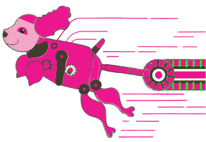
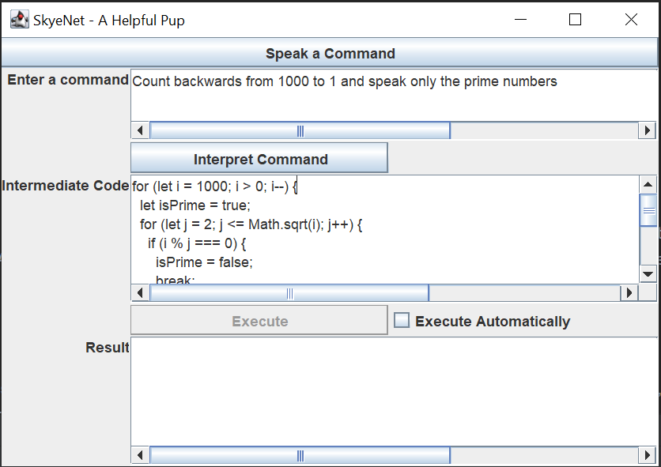

# SkyeNet - A Helpful Pup! 🐾⚡

[](https://www.apache.org/licenses/LICENSE-2.0)

<!-- TOC -->

* [SkyeNet - A Helpful Pup! 🐾⚡](#skyenet---a-helpful-pup-)
    * [🧪 The SkyeNet Experiment](#-the-skyenet-experiment)
    * [🏗️ The Building Blocks of SkyeNet](#-the-building-blocks-of-skyenet)
    * [🎨 Customizing Your SkyeNet Experience](#-customizing-your-skyenet-experience)
    * [💡 Example Usage](#-example-usage)
        * [📦 To Import](#-to-import)
        * [🌟 To Use](#-to-use)
    * [🚀 Unleashing SkyeNet's Potential](#-unleashing-skyenets-potential)

<!-- TOC -->



Greetings, intrepid explorer! You have stumbled upon the delightful realm of SkyeNet, a general-purpose AI assistant
that combines the linguistic prowess of OpenAI ChatGPT with Java's JSR223 scripting engine and Kotlin compiler. SkyeNet
is a unique proof-of-concept designed to bring an interactive, engaging AI experience to life. With the added
capabilities of OpenAI Whisper and Google Cloud Platform, SkyeNet lends its voice recognition and text-to-speech talents
to users brave enough to embark on this journey.

## 🧪 The SkyeNet Experiment

At its core, SkyeNet seeks to interpret natural language commands and execute them as JavaScript code. The assistant is
capable of understanding a wide variety of commands, making it a versatile and powerful tool for users seeking an
interactive AI companion. SkyeNet's components can be customized to meet the needs of different applications or to
create a unique and engaging user experience.



## 🏗️ The Building Blocks of SkyeNet

SkyeNet's components work together harmoniously to create a cohesive and lively AI assistant:

* **[Brain](src/main/kotlin/com/simiacryptus/skyenet/Brain.kt)**: The nucleus of SkyeNet's intellect, the brain
  interfaces with the OpenAI API and uses ChatGPT to perform coding tasks, giving life to our endearing AI assistant.
* **[Body](src/main/kotlin/com/simiacryptus/skyenet/Body.kt)**: Acting as the AI's vessel, the body connects the heart
  and brain, providing a framework for action and allowing SkyeNet to interact with its environment.
* **[Ears](src/main/kotlin/com/simiacryptus/skyenet/Ears.kt)**: These auditory organs capture sounds and transform them
  into actionable data, granting SkyeNet the gift of hearing.
* **[Mouth](src/main/kotlin/com/simiacryptus/skyenet/Mouth.kt)**: Bestowed with the ability to speak, SkyeNet's mouth
  interfaces with the Google Text-to-Speech API, enabling it to communicate with users through speech.
* **[Head](src/main/kotlin/com/simiacryptus/skyenet/Head.kt)**: The command center of the AI assistant, the head is
  responsible for capturing audio through the ears, interacting with the user via the face, and relaying commands to the
  body.
* **[Face](src/main/kotlin/com/simiacryptus/skyenet/Face.kt)**: The face is the graphical user interface, allowing
  SkyeNet to communicate with users visually and provide input and output in a user-friendly manner.
* **[Heart](src/main/kotlin/com/simiacryptus/skyenet/Heart.kt)**: The heart is the interface to the script evaluation
  engines that power SkyeNet, pumping life into the body and allowing the AI assistant to perform its various functions.

## 🎨 Customizing Your SkyeNet Experience

SkyeNet's ability to interpret natural language commands and execute them as JavaScript code allows you to
extend its functionality and create custom commands specific to your needs. This level of customization opens up a world
of possibilities for users to explore, making SkyeNet a versatile and powerful tool that can be adapted to a wide
variety of situations and tasks.

Key to this customization is the ability to define custom tools that can be used in commands. These tools can be
anything from simple functions to complex classes, and can be used to perform a wide variety of tasks. For example, a
tool could be used to perform a calculation, retrieve data from an API, or even call back into GPT via a JoePenai proxy.

## 💡 Example Usage

### 📦 To Import

https://mvnrepository.com/artifact/com.simiacryptus/skyenet

Maven:

```xml

<dependency>
    <groupId>com.simiacryptus</groupId>
    <artifactId>skyenet-webui</artifactId>
    <version>1.0.21</version>
</dependency>
```

Gradle:

```groovy
implementation group: 'com.simiacryptus', name: 'skyenet', version: '1.0.21'
```

```kotlin
implementation("com.simiacryptus:skyenet:1.0.21")
```

### 🌟 To Use

```kotlin
// Define OpenAI client
val body = Body(
  api = OpenAIClient(apiKey),
  apiObjects = mapOf(
    "toolObj" to TestTools(googleSpeechKey)
  )
)
val head = Head(body = body, ears = Ears(api = OpenAIClient(apiKey)))
val jFrame = head.start(client = OpenAIClient(apiKey))
while (jFrame.isVisible) {
  Thread.sleep(100)
}

class TestTools(keyfile: String) {
    // Private details will not be exported
    private val mouth = Mouth(keyfile)

    // Export methods to be called from the script
    @Export
    fun speak(text: String) = mouth.speak(text)
}
```

## 🚀 Unleashing SkyeNet's Potential

SkyeNet's unique combination of natural language understanding, voice recognition, text-to-speech, and JavaScript
execution capabilities opens up endless possibilities for users to harness the power of AI in creative and innovative
ways. From automating mundane tasks to developing complex applications, SkyeNet's versatility makes it an invaluable
assistant for both novice and experienced developers alike.

The possibilities are virtually endless, limited only by your imagination and ingenuity. As you embark on your SkyeNet
adventure, you'll find that the AI assistant is not only a versatile and powerful tool but also a delightful and
engaging companion that can help you push the boundaries of what's possible.

So, brave adventurer, are you ready to unleash the power of SkyeNet and embark on an extraordinary journey into the
world of AI? With its anthropomorphic components, humorous naming, and lively personality, SkyeNet is sure to capture
your heart and inspire your creativity. Don your lab coat, channel your inner Dr. Frankenstein, and prepare to awaken
the adorably powerful AI assistant that is SkyeNet!

# Disclaimer

This project is **_NOT_** affiliated with:

- OpenAI
- Google
- The Terminator Movie Franchise
- Paw Patrol
- Nickelodeon
- Paramount Pictures
- https://skyenet.tech/
- https://www.skyenet.co.uk/
- Skyenet wireless communications
- https://www.skye-nets.com/
- https://skyenet.social/
- https://www.facebook.com/Skyenetpro/
- https://eagleskyenet.com/
- https://www.instagram.com/skyenet/
- https://www.pinterest.com/Skyenetblog/
- SKYENET LIMITED UK Company number 12770700
- Skyenet Internet Solutions in Youngsville PA
- Skyenet - Email Format & Email Checker Service
- SKYENET INVESTMENTS PTY LTD
- Skynet Worldwide Express
- Skyenet Computer Services
- SkyeNet Solutions, LLC
- SKYEnet.live
- E Skyenet Ltd, Rotherham
- SkyeNet Investment Nig. Ltd
- SKYENET GLOBAL, LLC in Sugar Land, TX
- Any similarly named personas on any other social network
- etc
