# kotlin\com\simiacryptus\skyenet\core\actors\BaseActor.kt


## Developer Documentation for BaseActor Class

The `BaseActor` class serves as an abstract base for creating actors that interact with OpenAI's API to generate responses based on input. This class is designed to be extended for various types of actors that require different input types (`I`) and return types (`R`).


### Class Overview

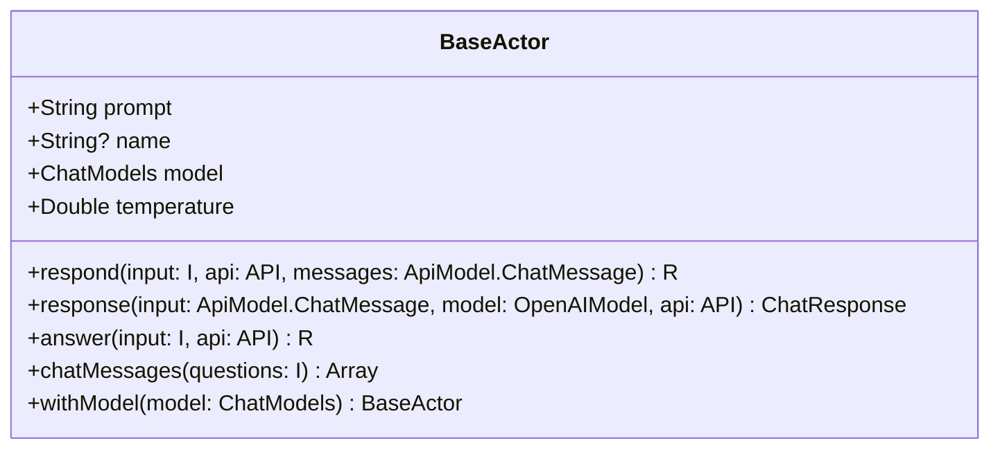
```mermaid
classDiagram
    class BaseActor {
        +String prompt
        +String? name
        +ChatModels model
        +Double temperature
        +respond(input: I, api: API, messages: ApiModel.ChatMessage) R
        +response(input: ApiModel.ChatMessage, model: OpenAIModel, api: API) ChatResponse
        +answer(input: I, api: API) R
        +chatMessages(questions: I) Array
        +withModel(model: ChatModels) BaseActor
    }
```


#### Properties

- `prompt`: The initial prompt or context used for generating responses.
- `name`: An optional name for the actor, which can be used for identification or logging purposes.
- `model`: The OpenAI model to be used for generating responses. This is specified using the `ChatModels` enum.
- `temperature`: Controls the randomness of the response generation. A lower value makes the model more deterministic.


#### Methods


##### `abstract fun respond(input: I, api: API, vararg messages: ApiModel.ChatMessage): R`

This abstract method must be implemented by subclasses to define how the actor responds to the given input and messages. It uses the provided API instance to interact with OpenAI's services.


##### `open fun response(vararg input: ApiModel.ChatMessage, model: OpenAIModel = this.model, api: API): ChatResponse`

Generates a response using the OpenAI API based on the provided chat messages. It allows overriding the model used for this specific response.


##### `open fun answer(input: I, api: API): R`

A high-level method that generates a response based on the input. It internally calls `chatMessages` to convert the input into chat messages and then `respond` to generate the final response.


##### `abstract fun chatMessages(questions: I): Array<ApiModel.ChatMessage>`

Converts the input into an array of `ApiModel.ChatMessage` instances. This method must be implemented by subclasses to define how input is transformed into a format suitable for the OpenAI API.


##### `abstract fun withModel(model: ChatModels): BaseActor<I,R>`

Creates a new instance of the actor with the specified model. This method allows changing the model used for response generation.


### Usage

To use the `BaseActor` class, you must extend it and implement the abstract methods. Here's a simplified example:

```kotlin
class TextActor(prompt: String, model: ChatModels) : BaseActor<String, String>(prompt, model = model) {
    override fun respond(input: String, api: API, vararg messages: ApiModel.ChatMessage): String {
        // Implementation for generating a response based on the input and messages
    }

    override fun chatMessages(questions: String): Array<ApiModel.ChatMessage> {
        // Convert the input string into chat messages
    }

    override fun withModel(model: ChatModels): BaseActor<String, String> {
        // Return a new instance of TextActor with the specified model
    }
}
```

This class is designed to be flexible and extensible for various types of interactions with OpenAI's API, allowing developers to create sophisticated actors for different applications.

# kotlin\com\simiacryptus\skyenet\core\actors\ActorSystem.kt


## ActorSystem Class Documentation

The `ActorSystem` class is a core component of the application that manages the lifecycle and interactions of various actors within the system. It is designed to be generic, supporting different types of actors identified by an enum (`T`). This class is responsible for initializing actors, managing their state, and providing a mechanism for actor interaction through interceptors.


### Overview

The `ActorSystem` class is structured to facilitate the management of actors in a session-based context, with support for user-specific data storage and session management. It leverages a pool of resources and a set of interceptors to enhance or modify the behavior of actors at runtime.


### Class Diagram

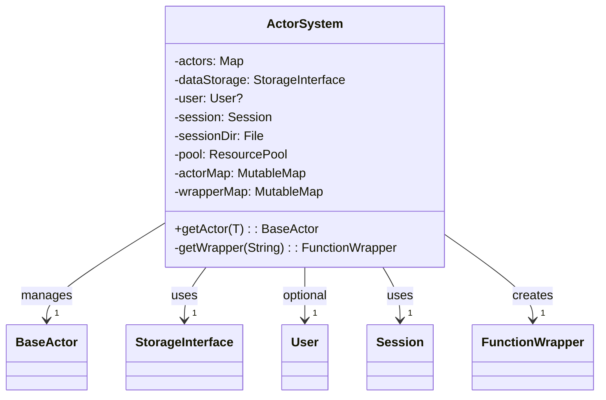
```mermaid
classDiagram
    class ActorSystem {
      -actors: Map
      -dataStorage: StorageInterface
      -user: User?
      -session: Session
      -sessionDir: File
      -pool: ResourcePool
      -actorMap: MutableMap
      -wrapperMap: MutableMap
      +getActor(T): BaseActor
      -getWrapper(String): FunctionWrapper
    }
    ActorSystem --> "1" BaseActor: manages
    ActorSystem --> "1" StorageInterface: uses
    ActorSystem --> "1" User: optional
    ActorSystem --> "1" Session: uses
    ActorSystem --> "1" FunctionWrapper: creates
```


### Key Components

- **actors**: A map of enum keys to `BaseActor` instances. This map defines the available actors within the system.
- **dataStorage**: An interface to the storage system, allowing actors to persist and retrieve data.
- **user**: An optional `User` instance representing the current user. This can be `null` if the actor system is used in a context without a specific user.
- **session**: The current `Session` instance, providing context for the actor operations.
- **sessionDir**: A `File` instance pointing to the directory where session-specific data is stored.
- **pool**: A lazy-initialized resource pool used by actors for executing tasks.


### Methods


#### getActor(actor: T): BaseActor<*, *>

Retrieves an instance of `BaseActor` for the specified actor enum. If the actor instance does not exist in the `actorMap`, it is created using the corresponding entry in the `actors` map. The creation process involves wrapping the actor with an appropriate interceptor based on its type (e.g., `SimpleActorInterceptor`, `ParsedActorInterceptor`).


#### getWrapper(name: String): FunctionWrapper

Retrieves or creates a `FunctionWrapper` instance for the specified actor name. This wrapper is used to intercept function calls within the actor, allowing for additional processing or logging. The wrapper is associated with a `JsonFunctionRecorder` that persists function call data to a file within the session directory.


### Usage Example

```kotlin
// Initialize the actor system with a predefined set of actors, storage interface, user, and session
val actorSystem = ActorSystem(actorsMap, storageInterface, user, session)

// Retrieve an actor from the system
val myActor = actorSystem.getActor(MyActorEnum.SOME_ACTOR)

// Use the actor for performing operations
myActor.performAction()
```


### Conclusion

The `ActorSystem` class provides a flexible and extensible framework for managing actors within an application. By abstracting actor initialization and providing support for function interception, it allows for sophisticated runtime behavior modifications and enhances the application's capabilities to handle complex workflows and data processing tasks.

# java\com\simiacryptus\skyenet\core\OutputInterceptor.java


## OutputInterceptor Documentation

The `OutputInterceptor` class is a utility designed to intercept and redirect standard output (`System.out`) and error output (`System.err`) streams in Java applications. This functionality is particularly useful for capturing and analyzing console output for logging, debugging, or testing purposes.


### Overview

The class provides mechanisms to:
- Intercept and reroute output from `System.out` and `System.err` to custom `ByteArrayOutputStream` instances.
- Retrieve and clear the captured output on both a per-thread basis and globally across all threads.


### Setup

To start intercepting output, call the `setupInterceptor` method. This method reroutes the standard and error output streams to internal mechanisms that capture the output.

```java
OutputInterceptor.setupInterceptor();
```


### Usage


#### Capturing Output

- **Thread-specific Output**: Output written by the current thread can be retrieved and cleared using `getThreadOutput` and `clearThreadOutput` methods, respectively.
- **Global Output**: Output written by all threads can be accessed and cleared using `getGlobalOutput` and `clearGlobalOutput` methods, respectively.


#### Retrieving Captured Output

- To get the output captured from the current thread:

  ```java
  String threadOutput = OutputInterceptor.getThreadOutput();
  ```

- To get the output captured globally across all threads:

  ```java
  String globalOutput = OutputInterceptor.getGlobalOutput();
  ```


#### Clearing Captured Output

- To clear the output captured from the current thread:

  ```java
  OutputInterceptor.clearThreadOutput();
  ```

- To clear the output captured globally:

  ```java
  OutputInterceptor.clearGlobalOutput();
  ```


### Implementation Details


#### Class Diagram

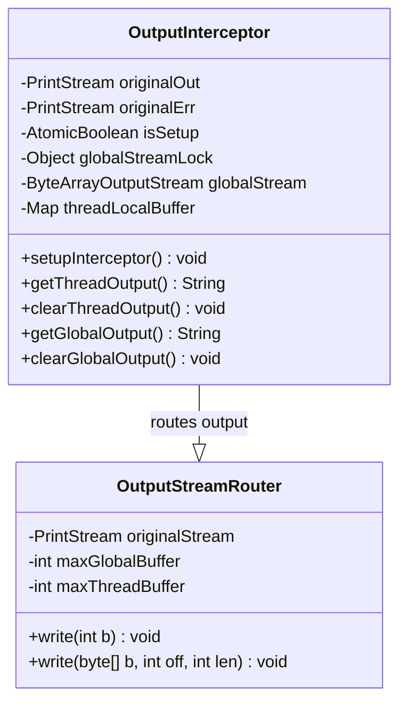
```mermaid
classDiagram
    class OutputInterceptor {
        -PrintStream originalOut
        -PrintStream originalErr
        -AtomicBoolean isSetup
        -Object globalStreamLock
        -ByteArrayOutputStream globalStream
        -Map threadLocalBuffer
        +setupInterceptor() void
        +getThreadOutput() String
        +clearThreadOutput() void
        +getGlobalOutput() String
        +clearGlobalOutput() void
    }
    class OutputStreamRouter {
        -PrintStream originalStream
        -int maxGlobalBuffer
        -int maxThreadBuffer
        +write(int b) void
        +write(byte[] b, int off, int len) void
    }
    OutputInterceptor --|> OutputStreamRouter : routes output
```


#### Thread Safety

The `OutputInterceptor` class is designed to be thread-safe. It uses synchronization on a global lock object (`globalStreamLock`) for operations affecting the global output stream, and a `WeakHashMap` for thread-local output streams to ensure thread safety and avoid memory leaks.


#### Memory Management

To prevent excessive memory usage, the `OutputStreamRouter` class imposes limits on the maximum size of both global and thread-local output buffers. When these limits are exceeded, the buffers are automatically reset.


### Conclusion

The `OutputInterceptor` class provides a powerful and flexible way to intercept, capture, and analyze output from Java applications. Its thread-safe design and memory management features make it suitable for use in a wide range of scenarios, from development and debugging to production logging and monitoring.

# kotlin\com\simiacryptus\skyenet\core\actors\CodingActor.kt


## Developer Documentation for `CodingActor`

The `CodingActor` class is a sophisticated component designed to facilitate the translation of natural language instructions into executable code, leveraging the capabilities of AI models. It serves as an intermediary that understands both the user's intent expressed in natural language and the technical requirements to fulfill that intent through code execution.


### Overview

`CodingActor` extends `BaseActor` and specializes in handling code-related requests and responses. It integrates with an interpreter to execute the generated code and provides mechanisms for automatic error correction and code evaluation.


#### Key Features

- **Natural Language to Code Translation**: Translates user instructions into executable code.
- **Dynamic Interpreter Integration**: Utilizes a specified interpreter for code execution.
- **Error Handling and Correction**: Attempts to correct errors in generated code automatically.
- **Customizable Code Formatting**: Supports customizable code formatting guidelines.
- **Extensible Type Description**: Uses a `TypeDescriber` for detailed API descriptions.


### Class Structure

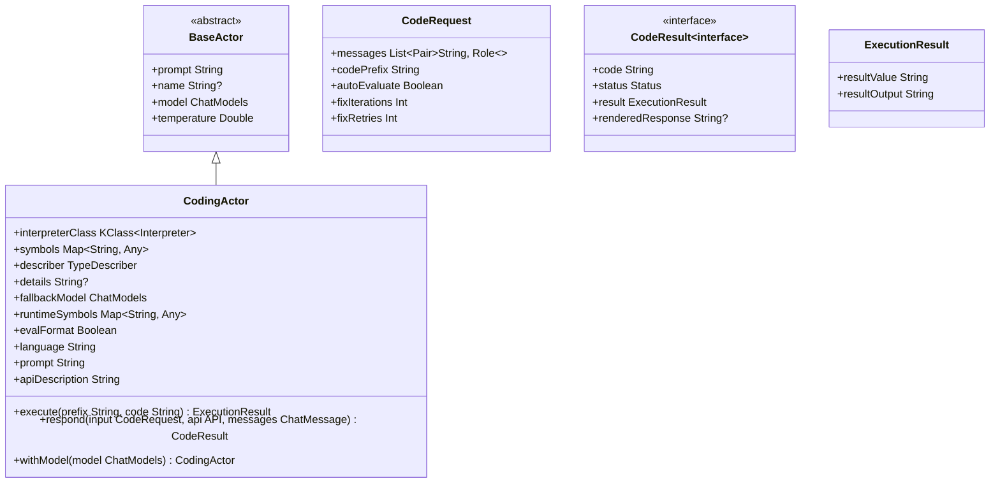
```mermaid
classDiagram
    BaseActor <|-- CodingActor
    CodingActor : +interpreterClass KClass~Interpreter~
    CodingActor : +symbols Map~String, Any~
    CodingActor : +describer TypeDescriber
    CodingActor : +details String?
    CodingActor : +fallbackModel ChatModels
    CodingActor : +runtimeSymbols Map~String, Any~
    CodingActor : +evalFormat Boolean
    CodingActor : +language String
    CodingActor : +prompt String
    CodingActor : +apiDescription String
    CodingActor : +execute(prefix String, code String) ExecutionResult
    CodingActor : +respond(input CodeRequest, api API, messages ChatMessage) CodeResult
    CodingActor : +withModel(model ChatModels) CodingActor
    class BaseActor{
      <<abstract>>
      +prompt String
      +name String?
      +model ChatModels
      +temperature Double
    }
    class CodeRequest{
      +messages List~Pair~String, Role~~
      +codePrefix String
      +autoEvaluate Boolean
      +fixIterations Int
      +fixRetries Int
    }
    class CodeResult~interface~{
      <<interface>>
      +code String
      +status Status
      +result ExecutionResult
      +renderedResponse String?
    }
    class ExecutionResult{
      +resultValue String
      +resultOutput String
    }
```


### Usage


#### Initialization

To create an instance of `CodingActor`, you need to provide:

- `interpreterClass`: The Kotlin class (`KClass`) of the interpreter to use for code execution.
- `symbols`: A map of predefined symbols that can be used within the code.
- `describer`: An instance of `TypeDescriber` for API description.
- Additional optional parameters such as `details`, `model`, `fallbackModel`, `temperature`, and `runtimeSymbols`.


#### Processing Requests

To process a coding request, create an instance of `CodeRequest` with:

- `messages`: A list of pairs containing the message and its role (`Role.system` or `Role.assistant`).
- Optional parameters like `codePrefix`, `autoEvaluate`, `fixIterations`, and `fixRetries`.

Call the `respond` method with the `CodeRequest` instance and other required parameters. This method returns an instance of `CodeResult`, which contains the generated code, execution status, and result.


#### Execution and Error Handling

The `execute` method runs the generated code using the specified interpreter and handles errors. If `autoEvaluate` is true, `respond` will automatically attempt to execute and correct the code.


### Extending `CodingActor`

To extend `CodingActor`:

1. Override necessary methods to customize behavior.
2. Use `withModel` to create a new instance with a different AI model.


### Conclusion

`CodingActor` is a powerful tool for bridging the gap between natural language instructions and executable code. By leveraging AI models and an extensible architecture, it offers a flexible and efficient way to automate coding tasks.

# kotlin\com\simiacryptus\skyenet\core\actors\ImageActor.kt


## ImageActor Class Documentation

The `ImageActor` class is a specialized actor designed to transform user requests into image generation prompts and subsequently generate images that align with the user's preferences. This class extends the `BaseActor` class and operates within the context of interacting with OpenAI's API for image generation, specifically targeting models like DALL-E 2.


### Overview

The `ImageActor` class is structured to first interpret a textual prompt through a chat model and then use the interpreted prompt to generate an image using an image model. This process involves several key components and steps, which are detailed below.


### Class Structure


#### Constructor Parameters

- `prompt`: The initial prompt used to guide the text generation process.
- `name`: An optional name for the actor.
- `textModel`: The chat model used for interpreting the user's request.
- `imageModel`: The image model used for generating images. Defaults to `ImageModels.DallE2`.
- `temperature`: Controls the randomness of the output. Lower values make the output more deterministic.
- `width`: The width of the generated image.
- `height`: The height of the generated image.


#### Methods

- `chatMessages(questions: List<String>)`: Prepares chat messages for interaction with the text model.
- `render(text: String, api: API)`: Generates an image based on the provided text prompt.
- `respond(input: List<String>, api: API, vararg messages: ChatMessage)`: Generates an `ImageResponse` based on the input questions and chat messages.
- `withModel(model: ChatModels)`: Returns a new instance of `ImageActor` with the specified chat model.


#### Inner Classes

- `ImageResponseImpl`: An implementation of the `ImageResponse` interface, encapsulating the text prompt and the generated image.


### Interfaces

- `ImageResponse`: An interface representing the response from the `ImageActor`, containing the text prompt and the generated image.


### Usage Flow

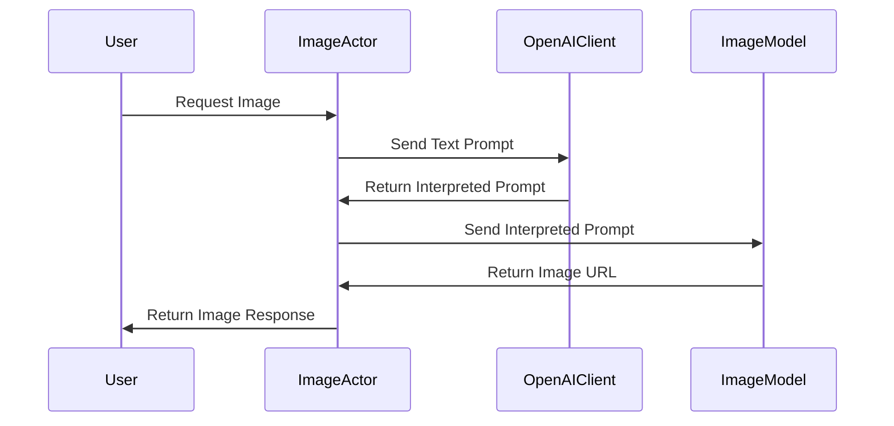
```mermaid
sequenceDiagram
    participant User
    participant ImageActor
    participant OpenAIClient
    participant ImageModel

    User->>ImageActor: Request Image
    ImageActor->>OpenAIClient: Send Text Prompt
    OpenAIClient->>ImageActor: Return Interpreted Prompt
    ImageActor->>ImageModel: Send Interpreted Prompt
    ImageModel->>ImageActor: Return Image URL
    ImageActor->>User: Return Image Response
```


### Example Usage

```kotlin
val imageActor = ImageActor(
    prompt = "Transform the user request into an image generation prompt that the user will like",
    textModel = OpenAIModels.GPT3_5_Turbo,
    imageModel = ImageModels.DallE2,
    temperature = 0.3,
    width = 1024,
    height = 1024
)

val api = OpenAIClient("your_api_key")

val questions = listOf("A futuristic cityscape at sunset")
val imageResponse = imageActor.respond(questions, api)

// Display or process the imageResponse.image as needed
```


### Conclusion

The `ImageActor` class provides a powerful abstraction for generating images based on textual prompts. By leveraging OpenAI's API and models, it simplifies the process of creating visually appealing images that meet user specifications.

# kotlin\com\simiacryptus\skyenet\core\actors\opt\Expectation.kt


## Developer Documentation: Expectation Module

The `Expectation` module within the `com.simiacryptus.skyenet.core.actors.opt` package provides a framework for evaluating responses based on predefined criteria. This module is designed to work with the OpenAI API client, facilitating the embedding and comparison of text responses against specified expectations. It consists of an abstract class `Expectation` and two concrete implementations: `VectorMatch` and `ContainsMatch`.


### Overview

The `Expectation` class serves as the foundation, defining the structure and expectations for its subclasses. Each subclass implements specific logic to match and score responses based on different criteria:

- `VectorMatch`: Evaluates responses by comparing the semantic similarity between the example text and the response text.
- `ContainsMatch`: Checks if the response contains a specified pattern, supporting both critical and non-critical matches.


#### Class Diagram

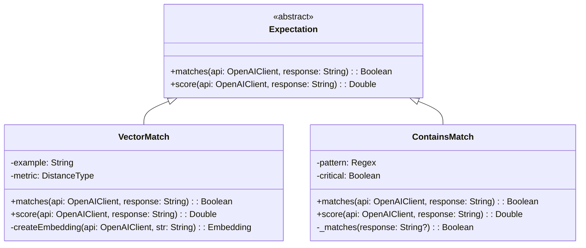
```mermaid
classDiagram
    class Expectation {
      <<abstract>>
      +matches(api: OpenAIClient, response: String): Boolean
      +score(api: OpenAIClient, response: String): Double
    }
    class VectorMatch {
      -example: String
      -metric: DistanceType
      +matches(api: OpenAIClient, response: String): Boolean
      +score(api: OpenAIClient, response: String): Double
      -createEmbedding(api: OpenAIClient, str: String): Embedding
    }
    class ContainsMatch {
      -pattern: Regex
      -critical: Boolean
      +matches(api: OpenAIClient, response: String): Boolean
      +score(api: OpenAIClient, response: String): Double
      -_matches(response: String?): Boolean
    }

    Expectation <|-- VectorMatch
    Expectation <|-- ContainsMatch
```


### Usage


#### VectorMatch

`VectorMatch` compares the semantic similarity between an example text and a response text. It uses embeddings to calculate the distance (similarity) between texts, supporting different distance metrics.


##### Example Usage

```kotlin
val vectorMatch = VectorMatch("Example text")
val similarityScore = vectorMatch.score(apiClient, "Response text")
```


#### ContainsMatch

`ContainsMatch` checks if the response contains a specified regex pattern. It can be configured to treat matches as critical or non-critical.


##### Example Usage

```kotlin
val containsMatch = ContainsMatch(Regex("pattern"), critical = true)
val matchResult = containsMatch.matches(apiClient, "Response text")
```


### Methods


#### Abstract Methods

- `matches(api: OpenAIClient, response: String): Boolean`: Determines if the response matches the expectation.
- `score(api: OpenAIClient, response: String): Double`: Calculates a score based on how well the response matches the expectation.


#### VectorMatch Specific

- `createEmbedding(api: OpenAIClient, str: String)`: Generates an embedding for the given string using the OpenAI API.


#### ContainsMatch Specific

- `_matches(response: String?): Boolean`: Helper method to check for regex pattern matches within the response.


### Logging

The module utilizes SLF4J for logging information, such as distance calculations in `VectorMatch` and pattern match failures in `ContainsMatch`.

---

This documentation provides an overview of the `Expectation` module's capabilities and usage within the context of evaluating text responses using the OpenAI API.

# kotlin\com\simiacryptus\skyenet\core\actors\opt\ActorOptimization.kt


## Developer Documentation for ActorOptimization

The `ActorOptimization` class is designed to optimize actor responses using genetic algorithms. It leverages the OpenAI API to generate, mutate, and recombine prompts to improve the quality of responses based on defined test cases.


### Overview

The optimization process involves generating a population of prompts, evaluating them against a set of test cases, and iteratively selecting, mutating, and recombining the best-performing prompts to produce a new generation of prompts. This process is repeated for a specified number of generations, with the goal of evolving prompts that yield the best responses from the actors.


### Key Components

- **OpenAIClient**: The client used to interact with the OpenAI API.
- **ChatModels**: The specific OpenAI model(s) to be used for generating, mutating, and recombining prompts.
- **mutationRate**: The probability of mutating a recombined prompt.
- **mutationTypes**: The types of mutations that can be applied to prompts, along with their associated probabilities.


### Core Methods


#### runGeneticGenerations

```kotlin
fun <I:List<String>,T:Any> runGeneticGenerations(
    prompts: List<String>,
    testCases: List<TestCase>,
    actorFactory: (String) -> BaseActor<I, T>,
    resultMapper: (T) -> String,
    selectionSize: Int = defaultSelectionSize(prompts),
    populationSize: Int = defaultPositionSize(selectionSize, prompts),
    generations: Int = 3
): List<String>
```

Generates and evolves a population of prompts over a specified number of generations, evaluating their performance against a set of test cases.


#### regenerate

```kotlin
open fun regenerate(progenetors: List<String>, desiredCount: Int): List<String>
```

Generates a new population of prompts by selecting, mutating, and recombining the best-performing prompts from the previous generation.


#### recombine

```kotlin
open fun recombine(a: String, b: String): String
```

Combines two prompts to produce a new prompt, with an optional mutation step.


#### mutate

```kotlin
open fun mutate(selected: String): String
```

Applies a random mutation to a prompt, altering it based on the specified mutation types.


### GeneticApi Interface

Defines the methods for mutating and recombining prompts.


#### Methods

- **mutate**: Applies a mutation to a prompt.
- **recombine**: Combines two prompts into a new prompt.


### Usage Flow

The following diagram illustrates the basic flow of using the `ActorOptimization` class to optimize actor prompts:

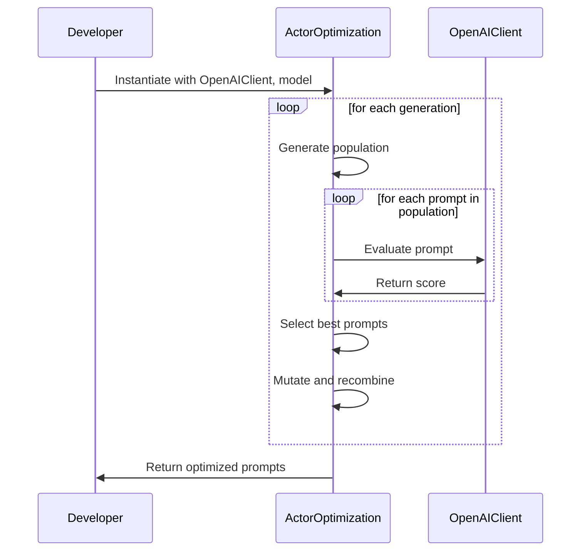
```mermaid
sequenceDiagram
    participant Developer
    participant ActorOptimization
    participant OpenAIClient
    Developer->>ActorOptimization: Instantiate with OpenAIClient, model
    loop for each generation
        ActorOptimization->>ActorOptimization: Generate population
        loop for each prompt in population
            ActorOptimization->>OpenAIClient: Evaluate prompt
            OpenAIClient->>ActorOptimization: Return score
        end
        ActorOptimization->>ActorOptimization: Select best prompts
        ActorOptimization->>ActorOptimization: Mutate and recombine
    end
    ActorOptimization->>Developer: Return optimized prompts
```


### Example

```kotlin
val apiClient = OpenAIClient("your_api_key")
val actorOptimization = ActorOptimization(apiClient, ChatModels.davinci)
val optimizedPrompts = actorOptimization.runGeneticGenerations(
    prompts = listOf("Initial prompt"),
    testCases = listOf(TestCase(...)),
    actorFactory = { prompt -> YourActor(prompt) },
    resultMapper = { result -> result.toString() }
)
```

This example demonstrates how to instantiate the `ActorOptimization` class, define test cases, and run the optimization process to evolve better prompts for your actors.

# kotlin\com\simiacryptus\skyenet\core\actors\ParsedActor.kt


## ParsedActor<T> Class Documentation

The `ParsedActor<T>` class is a specialized actor designed for parsing user messages into JSON objects of a specified type. It extends the `BaseActor<List<String>, ParsedResponse<T>>` class, leveraging the OpenAI API to interpret and transform textual input into structured data.


### Class Overview

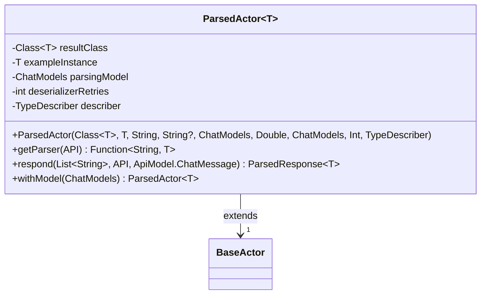
```mermaid
classDiagram
  class ParsedActor~T~ {
    -Class~T~ resultClass
    -T exampleInstance
    -ChatModels parsingModel
    -int deserializerRetries
    -TypeDescriber describer
    +ParsedActor(Class~T~, T, String, String?, ChatModels, Double, ChatModels, Int, TypeDescriber)
    +getParser(API) Function~String, T~
    +respond(List~String~, API, ApiModel.ChatMessage) ParsedResponse~T~
    +withModel(ChatModels) ParsedActor~T~
  }
  ParsedActor~T~ --> "1" BaseActor : extends
```


### Constructor Parameters

- `resultClass`: The class type of the result.
- `exampleInstance`: An instance of the result class, used as an example for parsing.
- `prompt`: The initial prompt to be used for the chat.
- `name`: An optional name for the actor, defaulting to the simple name of the result class.
- `model`: The OpenAI model to be used for generating responses.
- `temperature`: The temperature setting for the OpenAI model, influencing the randomness of responses.
- `parsingModel`: The OpenAI model specifically used for parsing.
- `deserializerRetries`: The number of retries for deserialization attempts.
- `describer`: A `TypeDescriber` instance for describing the result class type.


### Methods


#### getParser

Returns a function that takes a string input and returns an instance of `T` by parsing the input using the OpenAI API.

**Parameters:**
- `api`: The `API` instance to be used for making requests to OpenAI.


#### respond

Generates a `ParsedResponse<T>` from a list of input strings and additional chat messages.

**Parameters:**
- `input`: A list of input strings to be parsed.
- `api`: The `API` instance to be used for making requests to OpenAI.
- `messages`: Additional chat messages to be included in the request.


#### withModel

Creates a new instance of `ParsedActor<T>` with the specified OpenAI model.

**Parameters:**
- `model`: The OpenAI model to be used.


### Usage Example

```kotlin
val actor = ParsedActor(
    resultClass = MyClass::class.java,
    prompt = "Please parse the following message:",
    model = OpenAIModels.GPT_3_5_Turbo,
    parsingModel = OpenAIModels.GPT_3_5_Turbo
)

val api = OpenAIClient("your_api_key")
val parsedResponse = actor.respond(listOf("Your input message"), api)
val result: MyClass = parsedResponse.obj
```

This example demonstrates how to instantiate a `ParsedActor` for a hypothetical `MyClass`, use it to parse an input message, and retrieve the parsed object.


### Note

The `ParsedActor<T>` class is designed to work with the OpenAI API and requires a valid API key for operation. It is also important to handle exceptions and errors gracefully, especially considering the potential for parsing failures or API request limits.

# kotlin\com\simiacryptus\skyenet\core\actors\ParsedResponse.kt


## Developer Documentation for `ParsedResponse` Class

The `ParsedResponse` class serves as an abstract base for handling parsed responses in the `com.simiacryptus.skyenet.core.actors` package. It is designed to encapsulate the response obtained from various sources, providing a structured way to access both the raw text and the parsed object of a specified type.


### Class Overview

```kotlin
package com.simiacryptus.skyenet.core.actors

abstract class ParsedResponse<T>(val clazz: Class<T>) {
    abstract val text: String
    abstract val obj: T
    override fun toString() = text
}
```


#### Generics

- `T`: The type parameter `T` represents the type of the object that the response text will be parsed into. This allows for flexibility in handling different types of parsed data.


#### Constructor Parameters

- `clazz: Class<T>`: This parameter is used to specify the class type of the parsed object. It is essential for runtime type checks and casting.


#### Properties

- `text: String`: An abstract property that should be overridden to provide the raw text of the response.
- `obj: T`: An abstract property that should be overridden to provide the parsed object derived from the response text.


#### Methods

- `toString()`: Overrides the `toString` method to return the raw text of the response. This can be useful for debugging or logging purposes.


### Usage Diagram

To illustrate how the `ParsedResponse` class might be used within a system, consider the following mermaid.js diagram:

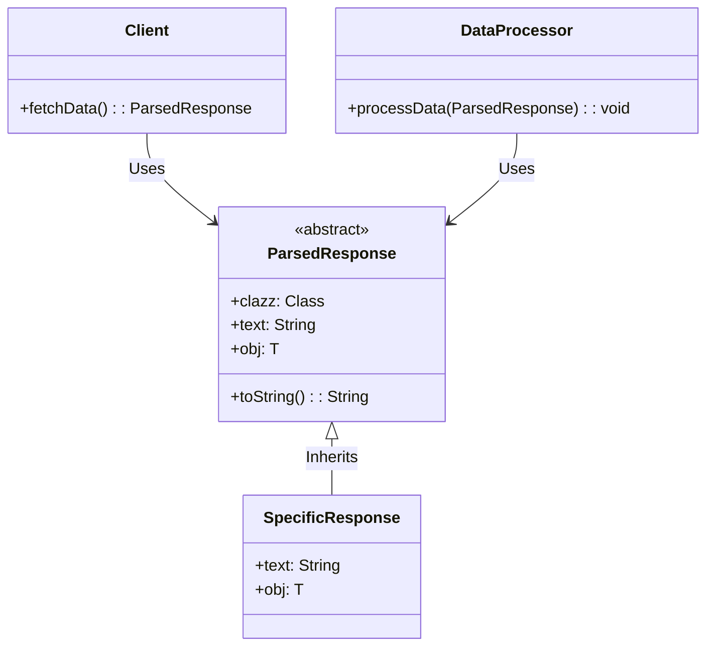
```mermaid
classDiagram
    class ParsedResponse {
        <<abstract>>
        +clazz: Class<T>
        +text: String
        +obj: T
        +toString(): String
    }
    class SpecificResponse {
        +text: String
        +obj: T
    }
    ParsedResponse <|-- SpecificResponse: Inherits
    
    class Client {
        +fetchData(): ParsedResponse
    }
    Client --> ParsedResponse: Uses
    
    class DataProcessor {
        +processData(ParsedResponse): void
    }
    DataProcessor --> ParsedResponse: Uses
```


#### Explanation

- `SpecificResponse`: Represents a concrete implementation of `ParsedResponse` tailored to a specific type of data. It provides concrete implementations for the abstract properties `text` and `obj`.
- `Client`: A class that fetches data and returns a `ParsedResponse` or one of its subclasses, encapsulating the fetched data.
- `DataProcessor`: A class that takes a `ParsedResponse` as input for processing. It can work with any subclass of `ParsedResponse`, making it flexible to changes in the type of data being processed.


### Conclusion

The `ParsedResponse` class provides a robust foundation for handling and encapsulating parsed responses. By using generics and abstract properties, it offers a flexible and type-safe way to work with different kinds of data across the system. Implementing classes need to provide concrete details for the raw text and the parsed object, allowing for specific handling of various response types.

# kotlin\com\simiacryptus\skyenet\core\actors\record\CodingActorInterceptor.kt


## Developer Documentation for `CodingActorInterceptor`

The `CodingActorInterceptor` class is designed to act as a decorator for instances of `CodingActor`, providing an interception layer for method calls related to code generation and execution. This allows for additional processing, such as logging, metrics collection, or modification of inputs and outputs, without modifying the original `CodingActor` implementation.


### Overview

The `CodingActorInterceptor` extends `CodingActor` and requires an instance of `CodingActor` (`inner`) and a `FunctionWrapper` (`functionInterceptor`) upon instantiation. The `inner` object represents the original actor that is being decorated, while the `functionInterceptor` is used to wrap method calls, allowing for custom logic to be executed before and after the original method.


### Class Diagram

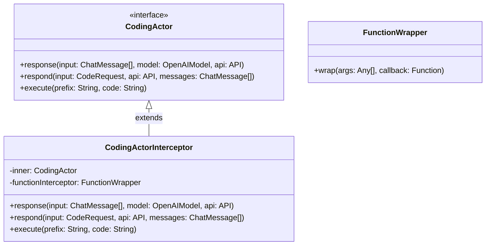
```mermaid
classDiagram
    class CodingActor {
        <<interface>>
        +response(input: ChatMessage[], model: OpenAIModel, api: API)
        +respond(input: CodeRequest, api: API, messages: ChatMessage[])
        +execute(prefix: String, code: String)
    }
    class CodingActorInterceptor {
        -inner: CodingActor
        -functionInterceptor: FunctionWrapper
        +response(input: ChatMessage[], model: OpenAIModel, api: API)
        +respond(input: CodeRequest, api: API, messages: ChatMessage[])
        +execute(prefix: String, code: String)
    }
    class FunctionWrapper {
        +wrap(args: Any[], callback: Function)
    }
    CodingActor <|-- CodingActorInterceptor : extends
```


### Key Methods


#### `response`

Overrides the `response` method from `CodingActor`. It uses the `functionInterceptor` to wrap the original `response` method of the `inner` `CodingActor`, allowing for interception of the method call.

**Parameters:**
- `input`: An array of `ChatMessage` objects representing the input messages.
- `model`: The `OpenAIModel` to use for generating responses.
- `api`: The `API` instance for interacting with external services.


#### `respond`

Overrides the `respond` method from `CodingActor`. It directly calls the `respond` method of the `inner` `CodingActor` but wraps the input and output through the `functionInterceptor`.

**Parameters:**
- `input`: A `CodeRequest` object representing the code generation request.
- `api`: The `API` instance for interacting with external services.
- `messages`: An array of `ChatMessage` objects representing additional context.


#### `execute`

Overrides the `execute` method from `CodingActor`. It uses the `functionInterceptor` to wrap the execution of code, allowing for interception and potential modification of the execution process.

**Parameters:**
- `prefix`: A `String` representing the prefix to be used in code execution.
- `code`: The actual code `String` to be executed.


### Usage Example

To use the `CodingActorInterceptor`, you first need an instance of `CodingActor` and a `FunctionWrapper` implementation. Then, you can create an instance of `CodingActorInterceptor` and use it in place of the original `CodingActor`.

```kotlin
val originalActor: CodingActor = ...
val functionWrapper: FunctionWrapper = ...
val interceptor = CodingActorInterceptor(originalActor, functionWrapper)

// Now you can use `interceptor` in place of `originalActor`
```

This setup allows you to intercept and augment the behavior of `CodingActor` methods transparently, enabling advanced use cases like logging, monitoring, or dynamic modification of inputs/outputs.

# kotlin\com\simiacryptus\skyenet\core\actors\record\ParsedActorInterceptor.kt


## ParsedActorInterceptor Class Documentation

The `ParsedActorInterceptor` class is an extension of the `ParsedActor` class designed to intercept and modify responses from a parsed actor in a flexible manner. It is part of the `com.simiacryptus.skyenet.core.actors.record` package and is used to enhance or alter the behavior of an existing `ParsedActor` instance by applying custom logic to its responses.


### Class Overview

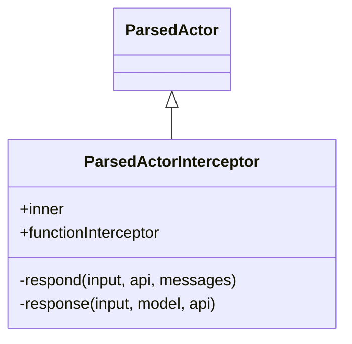
```mermaid
classDiagram
    ParsedActor <|-- ParsedActorInterceptor
    ParsedActorInterceptor : +inner
    ParsedActorInterceptor : +functionInterceptor
    ParsedActorInterceptor : -respond(input, api, messages)
    ParsedActorInterceptor : -response(input, model, api)
```


#### Constructor Parameters

- `inner`: The `ParsedActor` instance that this interceptor wraps. This is the actor whose responses are to be intercepted.
- `functionInterceptor`: An instance of `FunctionWrapper`, which provides the logic for intercepting and potentially modifying the responses.


#### Methods


##### `respond`

Overrides the `respond` method from the `ParsedActor` class. It takes a list of input strings and additional parameters to generate a response. This method utilizes the `functionInterceptor` to apply custom logic to the response.

**Parameters:**
- `input`: A list of input strings for the actor to respond to.
- `api`: An instance of `API` to interact with external services.
- `messages`: Vararg parameter of `com.simiacryptus.jopenai.ApiModel.ChatMessage`, representing additional context or messages.

**Returns:** An instance of `ParsedResponse<Any>`, which contains the intercepted and potentially modified response.


##### `response`

Overrides the `response` method from the `ParsedActor` class. It is designed to handle responses based on chat messages, model, and API.

**Parameters:**
- `input`: Vararg parameter of `com.simiacryptus.jopenai.ApiModel.ChatMessage`, representing the input messages.
- `model`: An instance of `OpenAIModel` specifying the model to use for generating responses.
- `api`: An instance of `API` for interacting with external services.

**Returns:** The result of the intercepted response, as modified by the `functionInterceptor`.


### Usage Example

To use the `ParsedActorInterceptor`, you first need an instance of a `ParsedActor` and a `FunctionWrapper` that defines how you want to intercept and modify the responses. Once you have these, you can create an instance of `ParsedActorInterceptor` and use it in place of the original `ParsedActor`.

```kotlin
val originalActor = ParsedActor<YourResultClass>(
    // Initialization parameters for your ParsedActor
)

val interceptor = FunctionWrapper { input, resultClass, function ->
    // Your interception logic here
}

val actorInterceptor = ParsedActorInterceptor(
    inner = originalActor,
    functionInterceptor = interceptor
)

// Now you can use actorInterceptor in place of originalActor
```

This setup allows you to seamlessly modify the behavior of any `ParsedActor` instance, making it a powerful tool for customizing response handling in your application.

# kotlin\com\simiacryptus\skyenet\core\actors\record\ImageActorInterceptor.kt


## Developer Documentation for `ImageActorInterceptor`

The `ImageActorInterceptor` class is a part of the `com.simiacryptus.skyenet.core.actors.record` package, designed to intercept and potentially modify the behavior of an `ImageActor` instance. This class is particularly useful for debugging, logging, or applying custom transformations to the inputs or outputs of the `ImageActor` methods.


### Overview

`ImageActorInterceptor` extends `ImageActor`, allowing it to seamlessly integrate into places where an `ImageActor` is expected. It wraps around an existing `ImageActor` instance, intercepting calls to the `response` and `render` methods. This interception is facilitated by a `FunctionWrapper` instance, which provides the mechanism to wrap and potentially modify the behavior of these methods.


### Class Diagram

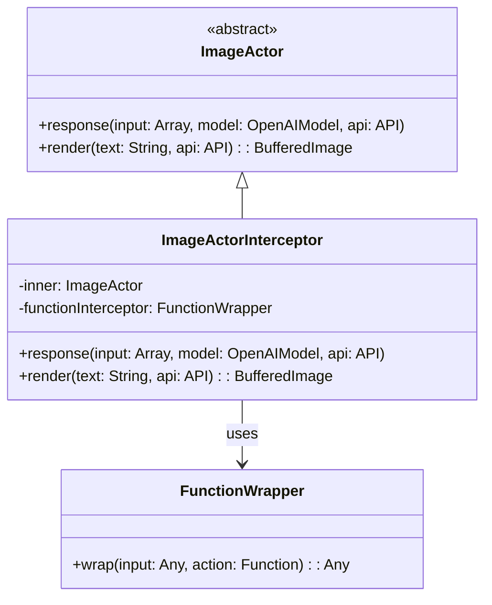
```mermaid
classDiagram
    class ImageActor {
        <<abstract>>
        +response(input: Array, model: OpenAIModel, api: API)
        +render(text: String, api: API): BufferedImage
    }
    class ImageActorInterceptor {
        -inner: ImageActor
        -functionInterceptor: FunctionWrapper
        +response(input: Array, model: OpenAIModel, api: API)
        +render(text: String, api: API): BufferedImage
    }
    class FunctionWrapper {
        +wrap(input: Any, action: Function): Any
    }
    ImageActor <|-- ImageActorInterceptor
    ImageActorInterceptor --> FunctionWrapper : uses
```


### Constructor Parameters

- `inner: ImageActor`: The `ImageActor` instance that this interceptor wraps around.
- `functionInterceptor: FunctionWrapper`: The `FunctionWrapper` instance used to intercept and potentially modify the behavior of the `inner` `ImageActor`'s methods.


### Methods


#### `response`

Overrides the `response` method from `ImageActor`. It intercepts calls to the `inner` `ImageActor`'s `response` method, allowing for pre-processing of the input messages and/or post-processing of the output.

**Parameters:**

- `input: vararg com.simiacryptus.jopenai.ApiModel.ChatMessage`: The input messages to the chat model.
- `model: OpenAIModel`: The OpenAI model to use for generating responses.
- `api: API`: The API instance for interacting with OpenAI services.

**Returns:** The result of the `inner` `ImageActor`'s `response` method, potentially modified by the `functionInterceptor`.


#### `render`

Overrides the `render` method from `ImageActor`. It intercepts calls to the `inner` `ImageActor`'s `render` method, allowing for pre-processing of the input text and/or post-processing of the output image.

**Parameters:**

- `text: String`: The input text to render into an image.
- `api: API`: The API instance for interacting with OpenAI services.

**Returns:** A `BufferedImage` generated by the `inner` `ImageActor`'s `render` method, potentially modified by the `functionInterceptor`.


### Usage Example

```kotlin
val originalActor = ImageActor(...)
val functionWrapper = FunctionWrapper { input, action ->
    // Custom logic before calling the original method
    val result = action(input)
    // Custom logic after calling the original method
    result
}
val interceptor = ImageActorInterceptor(originalActor, functionWrapper)

// Now, use `interceptor` wherever an `ImageActor` is expected.
```

This setup allows developers to inject custom logic before and after the execution of the `response` and `render` methods of an `ImageActor`, without modifying the original `ImageActor` implementation.

# kotlin\com\simiacryptus\skyenet\core\actors\record\SimpleActorInterceptor.kt


## Developer Documentation: SimpleActorInterceptor

The `SimpleActorInterceptor` class is designed to act as a decorator for instances of `SimpleActor`, allowing developers to intercept and potentially modify the behavior of the `SimpleActor`'s `response` method. This class is part of the `com.simiacryptus.skyenet.core.actors.record` package and leverages functionality from the `com.simiacryptus.jopenai` package for OpenAI model interactions.


### Overview

The `SimpleActorInterceptor` extends `SimpleActor` and overrides its `response` method. It introduces an interception layer through which all calls to the `response` method are passed. This interception is facilitated by a `FunctionWrapper`, which can modify the input, output, or behavior of the `response` method dynamically at runtime.


### Class Diagram

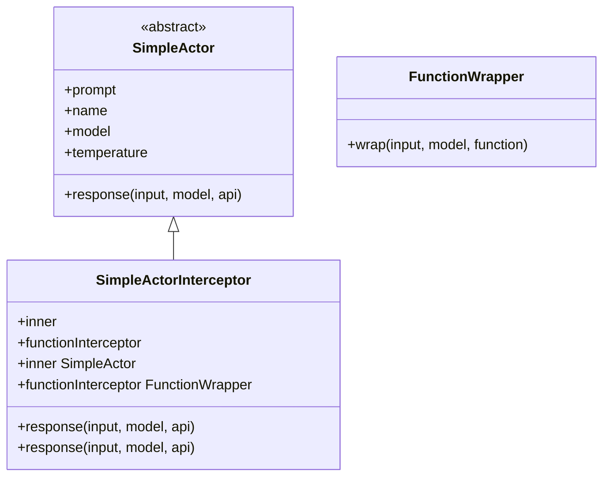
```mermaid
classDiagram
    SimpleActor <|-- SimpleActorInterceptor
    SimpleActorInterceptor : +inner
    SimpleActorInterceptor : +functionInterceptor
    SimpleActorInterceptor : +response(input, model, api)
    class SimpleActor{
      <<abstract>>
      +prompt
      +name
      +model
      +temperature
      +response(input, model, api)
    }
    class SimpleActorInterceptor{
      +inner SimpleActor
      +functionInterceptor FunctionWrapper
      +response(input, model, api)
    }
    class FunctionWrapper{
      +wrap(input, model, function)
    }
```


### Constructor Parameters

- `inner`: The `SimpleActor` instance that this interceptor wraps.
- `functionInterceptor`: An instance of `FunctionWrapper` that defines how to intercept the `response` method calls.


### Methods


#### response

Overrides the `response` method from `SimpleActor`. It uses the `functionInterceptor` to potentially modify the behavior of the `inner` `SimpleActor`'s `response` method.

**Signature:**

```kotlin
override fun response(
    vararg input: com.simiacryptus.jopenai.ApiModel.ChatMessage,
    model: OpenAIModel,
    api: API
): ReturnType
```

**Parameters:**

- `input`: Variable number of `ChatMessage` instances representing the input messages.
- `model`: The `OpenAIModel` to use for generating responses.
- `api`: The `API` instance for interacting with the OpenAI API.

**Return Value:**

The return type is dependent on the implementation of the `functionInterceptor`'s `wrap` method, which could modify the return value of the `inner` `SimpleActor`'s `response` method.


### Usage Example

```kotlin
val simpleActor = SimpleActor(prompt = "Your prompt", name = "ActorName", model = yourModel, temperature = 0.5)
val interceptor = FunctionWrapper { input, model, function ->
    // Modify input or behavior here
    function(input, model)
}
val simpleActorInterceptor = SimpleActorInterceptor(simpleActor, interceptor)

// Now, when calling response, the interceptor's logic will be applied.
simpleActorInterceptor.response(inputMessages, model, api)
```

This documentation provides a comprehensive overview of the `SimpleActorInterceptor` class, its purpose, and how it can be utilized to intercept and modify the behavior of `SimpleActor` instances dynamically.

# kotlin\com\simiacryptus\skyenet\core\actors\SimpleActor.kt


## SimpleActor Class Documentation

The `SimpleActor` class is a specialized actor designed for interacting with OpenAI's GPT models via the `com.simiacryptus.jopenai` API. It extends the `BaseActor` class, providing a simple interface for sending prompts to the model and receiving responses.


### Class Overview

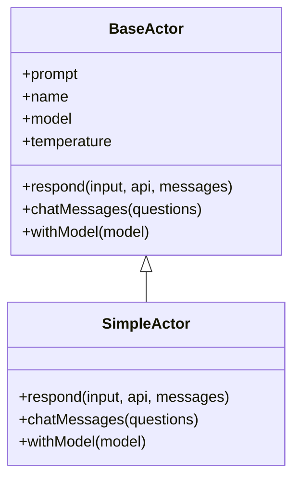
```mermaid
classDiagram
    BaseActor <|-- SimpleActor
    BaseActor : +prompt
    BaseActor : +name
    BaseActor : +model
    BaseActor : +temperature
    BaseActor : +respond(input, api, messages)
    BaseActor : +chatMessages(questions)
    BaseActor : +withModel(model)
    SimpleActor : +respond(input, api, messages)
    SimpleActor : +chatMessages(questions)
    SimpleActor : +withModel(model)
```


### Constructor

The `SimpleActor` class constructor initializes a new instance with the specified parameters.

```kotlin
SimpleActor(
    prompt: String,
    name: String? = null,
    model: ChatModels,
    temperature: Double = 0.3,
)
```


#### Parameters

- `prompt`: The initial prompt or question to be sent to the model.
- `name`: An optional name for the actor. If not provided, a default name may be used.
- `model`: The GPT model to be used for generating responses.
- `temperature`: Controls the randomness of the response. Lower values make responses more deterministic.


### Methods


#### respond

Generates a response based on the input and the specified messages.

```kotlin
override fun respond(input: List<String>, api: API, vararg messages: ApiModel.ChatMessage): String
```


##### Parameters

- `input`: A list of strings representing the input for the model.
- `api`: An instance of the `API` class to interact with the OpenAI API.
- `messages`: Variable number of `ApiModel.ChatMessage` objects representing the conversation history.


##### Returns

- A `String` representing the model's response.


##### Throws

- `RuntimeException` if no response is received.


#### chatMessages

Prepares the chat messages to be sent to the model based on the provided questions.

```kotlin
override fun chatMessages(questions: List<String>): Array<ApiModel.ChatMessage>
```


##### Parameters

- `questions`: A list of strings representing the questions to be sent to the model.


##### Returns

- An array of `ApiModel.ChatMessage` objects representing the formatted chat messages.


#### withModel

Creates a new instance of `SimpleActor` with the specified model.

```kotlin
override fun withModel(model: ChatModels): SimpleActor
```


##### Parameters

- `model`: The GPT model to be used for generating responses.


##### Returns

- A new instance of `SimpleActor` configured with the specified model.


### Usage Example

```kotlin
val actor = SimpleActor(
    prompt = "Hello, how can I assist you today?",
    model = ChatModels.gpt3_5_turbo,
    temperature = 0.3
)

val api = API("your_api_key")
val response = actor.respond(
    input = listOf("What's the weather like today?"),
    api = api
)

println(response)
```

This example demonstrates how to create an instance of `SimpleActor`, send a prompt to the model, and print the response.

# kotlin\com\simiacryptus\skyenet\core\actors\record\TextToSpeechActorInterceptor.kt


## Developer Documentation for `TextToSpeechActorInterceptor`

The `TextToSpeechActorInterceptor` class is designed to act as a decorator for instances of `TextToSpeechActor`, providing an interception mechanism for the `response` and `render` methods through a `FunctionWrapper`. This allows for additional processing, logging, or modification of inputs and outputs without altering the original `TextToSpeechActor` behavior.


### Class Overview

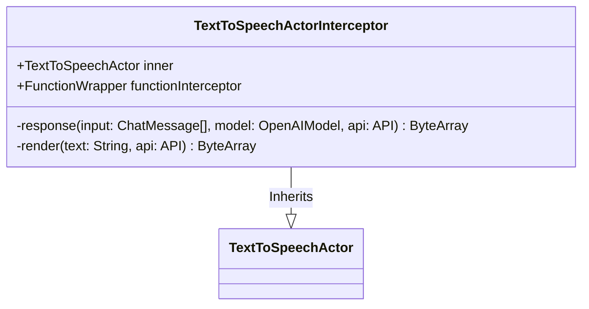
```mermaid
classDiagram
    class TextToSpeechActorInterceptor {
        +TextToSpeechActor inner
        +FunctionWrapper functionInterceptor
        -response(input: ChatMessage[], model: OpenAIModel, api: API) ByteArray
        -render(text: String, api: API) ByteArray
    }
    TextToSpeechActorInterceptor --|> TextToSpeechActor: Inherits
```


#### Constructor Parameters

- `inner`: The `TextToSpeechActor` instance that this interceptor will wrap.
- `functionInterceptor`: A `FunctionWrapper` instance used to intercept calls to the `response` and `render` methods.


#### Methods


##### `response`

Intercepts calls to the `response` method of the `TextToSpeechActor`. It allows for pre-processing or post-processing of the input messages and the model before delegating the call to the original `TextToSpeechActor` instance.

**Parameters:**

- `input`: An array of `ChatMessage` objects representing the input messages.
- `model`: An `OpenAIModel` instance specifying the model to use for generating responses.
- `api`: An `API` instance for interacting with the OpenAI API.

**Returns:** A `ByteArray` representing the audio data generated by the `TextToSpeechActor`.


##### `render`

Intercepts calls to the `render` method of the `TextToSpeechActor`. It allows for pre-processing or post-processing of the input text before delegating the call to the original `TextToSpeechActor` instance.

**Parameters:**

- `text`: A `String` representing the text to be converted to speech.
- `api`: An `API` instance for interacting with the OpenAI API.

**Returns:** A `ByteArray` representing the audio data generated by the `TextToSpeechActor`.


### Usage Example

```kotlin
// Create an instance of TextToSpeechActor
val originalActor = TextToSpeechActor("actorName", audioModel, "alloy", 1.0, OpenAIModels.GPT35Turbo)

// Define a function wrapper to intercept calls
val interceptor = FunctionWrapper()

// Create the TextToSpeechActorInterceptor
val actorInterceptor = TextToSpeechActorInterceptor(originalActor, interceptor)

// Use the interceptor to process text to speech
val audioData = actorInterceptor.render("Hello, world!", apiInstance)
```

This setup allows developers to inject custom logic, such as logging, metrics collection, or input/output modification, into the process of generating text-to-speech responses without modifying the core functionality of the `TextToSpeechActor`.

# kotlin\com\simiacryptus\skyenet\core\actors\test\CodingActorTestBase.kt


## Developer Documentation for `CodingActorTestBase`

The `CodingActorTestBase` class is an abstract base class designed for testing coding actors in the Skyenet framework. It extends the `ActorTestBase` class, specializing in handling code requests and results through the `CodingActor` class. This document provides an overview of its structure, usage, and key components.


### Overview

`CodingActorTestBase` facilitates the testing of coding actors, which are specialized actors designed to generate code based on given prompts. It leverages an interpreter (specified by the subclass) and a model (GPT-3.5 Turbo by default) to process coding requests and generate code snippets as responses.


### Class Diagram

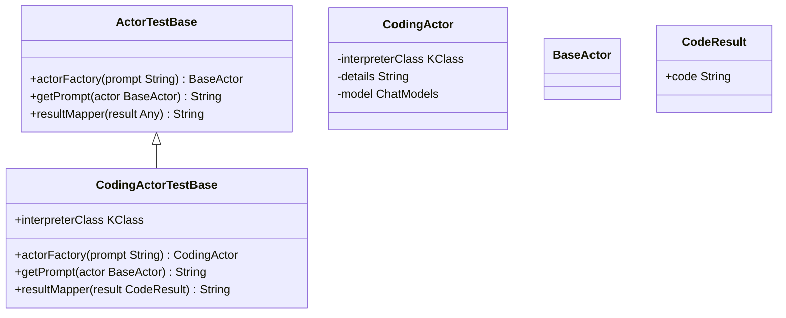
```mermaid
classDiagram
    ActorTestBase <|-- CodingActorTestBase
    CodingActorTestBase : +interpreterClass KClass
    CodingActorTestBase : +actorFactory(prompt String) CodingActor
    CodingActorTestBase : +getPrompt(actor BaseActor) String
    CodingActorTestBase : +resultMapper(result CodeResult) String
    class ActorTestBase{
        +actorFactory(prompt String) BaseActor
        +getPrompt(actor BaseActor) String
        +resultMapper(result Any) String
    }
    class CodingActor{
        -interpreterClass KClass
        -details String
        -model ChatModels
    }
    class BaseActor{
    }
    class CodeResult{
        +code String
    }
```


### Key Components


#### Properties

- `abstract val interpreterClass: KClass<out Interpreter>`: Specifies the class of the interpreter to be used by the `CodingActor`. This must be provided by the subclass.


#### Methods

- `override fun actorFactory(prompt: String): CodingActor`: Creates an instance of `CodingActor` with the specified `interpreterClass`, `details` (prompt), and the model set to `OpenAIModels.GPT35Turbo`.
- `override fun getPrompt(actor: BaseActor<CodeRequest, CodeResult>): String`: Retrieves the prompt details from the given `CodingActor` instance.
- `override fun resultMapper(result: CodeResult): String`: Maps the `CodeResult` to its `code` property, effectively extracting the generated code snippet.


### Usage

To use `CodingActorTestBase`, a subclass must be created that provides a concrete implementation for the `interpreterClass` property. This subclass can then instantiate `CodingActor` instances tailored to specific testing scenarios, leveraging the provided model and interpreter for generating code based on prompts.


#### Example Subclass

```kotlin
class MyCodingActorTest : CodingActorTestBase() {
    override val interpreterClass = MyCustomInterpreter::class
}
```

In this example, `MyCustomInterpreter` would be a class that extends `Interpreter`, tailored to the specific needs of the test scenarios being developed.


### Conclusion

`CodingActorTestBase` provides a structured approach to testing coding actors within the Skyenet framework, abstracting away common functionalities such as actor instantiation and result mapping. By extending this class and providing an interpreter, developers can efficiently create robust tests for their coding actors, ensuring their functionality and reliability.

# kotlin\com\simiacryptus\skyenet\core\actors\test\ActorTestBase.kt


## Developer Documentation for `ActorTestBase`

The `ActorTestBase` class serves as an abstract base for testing actors within a system designed to interact with OpenAI's GPT models. It provides a structured way to optimize and test actors based on predefined test cases.


### Overview

`ActorTestBase` is an abstract class that requires the implementation of several key components to facilitate the testing and optimization of actors. These components include the actor itself, a method to generate actors based on prompts, and a way to map the results to a string representation. Additionally, it integrates with the OpenAI API through the `OpenAIClient`.


#### Key Components

- **Actor**: Represents the entity being tested. It is responsible for generating responses based on inputs and prompts.
- **Test Cases**: A collection of scenarios used to evaluate the actor's performance.
- **Actor Factory**: A method to create new instances of the actor based on a given prompt.
- **Result Mapper**: A method to convert the actor's response into a string format for logging or comparison.


### Workflow

The testing and optimization process involves several steps, including setting up test cases, running optimizations, and executing tests to evaluate the actor's performance.


#### Optimization Process

The optimization process (`opt` method) utilizes a genetic algorithm approach to evolve the actor based on the provided test cases. It involves generating a population of actors, evaluating their performance, and selecting the best performers for the next generation.

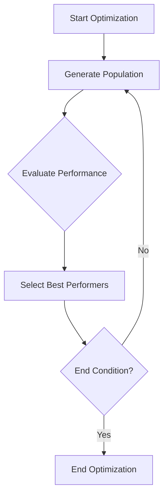
```mermaid
flowchart TD
    A[Start Optimization] --> B[Generate Population]
    B --> C{Evaluate Performance}
    C --> D[Select Best Performers]
    D --> E{End Condition?}
    E -->|No| B
    E -->|Yes| F[End Optimization]
```


#### Testing Process

The testing process (`testRun` method) iterates through the provided test cases, generating responses from the actor and logging the results. This allows for a manual review of the actor's performance in specific scenarios.

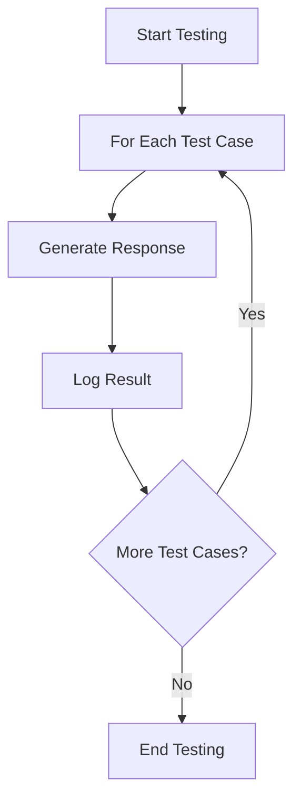
```mermaid
flowchart TD
    A[Start Testing] --> B[For Each Test Case]
    B --> C[Generate Response]
    C --> D[Log Result]
    D --> E{More Test Cases?}
    E -->|Yes| B
    E -->|No| F[End Testing]
```


### Implementation Requirements

To utilize the `ActorTestBase` class, the following abstract members must be implemented:

- `testCases`: A list of test cases for evaluating the actor.
- `actor`: The instance of the actor being tested.
- `actorFactory(prompt: String)`: A method to create new instances of the actor based on a prompt.
- `getPrompt(actor: BaseActor<I, R>)`: A method to generate a prompt for the actor based on its current state.
- `resultMapper(result: R)`: A method to convert the actor's response into a string format.


### Usage

To use the `ActorTestBase`, extend this class with a concrete implementation that provides the necessary components. Then, call `testOptimize` to run the optimization process or `testRun` to execute the test cases.


### Conclusion

The `ActorTestBase` class provides a structured approach to testing and optimizing actors within a system. By implementing the required abstract members and following the outlined processes, developers can efficiently evaluate and improve their actors' performance.

# kotlin\com\simiacryptus\skyenet\core\actors\test\ImageActorTestBase.kt


## Developer Documentation for `ImageActorTestBase`

The `ImageActorTestBase` class is an abstract class designed for testing image-based actors within the Skyenet framework. It extends the generic `ActorTestBase` class, specifying `List<String>` as the input type and `ImageResponse` as the output type. This setup is tailored for testing actors that generate images based on textual prompts.


### Overview

The purpose of `ImageActorTestBase` is to provide a foundational structure for testing implementations of `ImageActor`. It encapsulates the common logic required for initializing an `ImageActor` with a specific prompt and a designated text model. The class is abstract, indicating that it is intended to be extended by concrete test classes that implement specific test scenarios for image generation actors.


### Class Diagram

```mermaid
classDiagram
    ActorTestBase <|-- ImageActorTestBase
    ImageActorTestBase : +actorFactory(prompt: String) ImageActor
    ActorTestBase : +testActor(input: List~String~, expectedOutput: ImageResponse)
    class ActorTestBase{
        <<abstract>>
        +actorFactory(prompt: String)
        +testActor(input, expectedOutput)
    }
    class ImageActor{
        +prompt: String
        +textModel: ChatModels
    }
    class ImageResponse{
    }
```


### Key Components


#### `ImageActorTestBase`

- **Type Parameters**: Inherits `<List<String>, ImageResponse>` from `ActorTestBase`, indicating it takes a list of strings as input and produces an `ImageResponse`.
- **Methods**:
  - `actorFactory(prompt: String)`: This abstract method is overridden to return an instance of `ImageActor` configured with the provided `prompt` and the `GPT35Turbo` model from `ChatModels`.


#### `ActorTestBase`

- This is a generic abstract class that `ImageActorTestBase` extends. It defines the structure for testing actors by specifying an `actorFactory` method that must be implemented by subclasses and a `testActor` method for running tests.


#### `ImageActor`

- Represents an actor that generates images based on textual prompts. It is initialized with a `prompt` and a `textModel` for generating responses.


#### `ImageResponse`

- A class representing the response from an `ImageActor`. It encapsulates the generated image data.


### Usage

To use `ImageActorTestBase`, developers should create a subclass that implements specific tests for `ImageActor` implementations. The subclass must provide concrete logic for how tests are executed, including defining expected outputs and handling assertions.


#### Example

```kotlin
class MyImageActorTest : ImageActorTestBase() {
    @Test
    fun testImageGeneration() {
        val prompt = "A beautiful landscape"
        val expectedImageResponse = ImageResponse(/* Expected image data */)
        testActor(listOf(prompt), expectedImageResponse)
    }
}
```

In this example, `MyImageActorTest` extends `ImageActorTestBase` and implements a test method that specifies a prompt and an expected image response. The `testActor` method from `ActorTestBase` is used to run the test, which internally uses the `actorFactory` method to create an `ImageActor` instance for the test.


### Conclusion

`ImageActorTestBase` provides a structured approach to testing image generation actors within the Skyenet framework. By extending this class and implementing specific test scenarios, developers can efficiently test and validate the functionality of `ImageActor` implementations.

# kotlin\com\simiacryptus\skyenet\core\actors\TextToSpeechActor.kt


## TextToSpeechActor Documentation

The `TextToSpeechActor` class is part of the `com.simiacryptus.skyenet.core.actors` package and is designed to convert text to speech using OpenAI's API. This document provides an overview of its functionality, usage, and key components.


### Overview

`TextToSpeechActor` extends `BaseActor` and is specialized in handling text-to-speech (TTS) conversion. It leverages OpenAI's API to generate speech from text inputs. The class supports customization of the audio model, voice, and speed of the speech output.


### Key Components


#### Constructor Parameters

- `name`: Optional name for the actor.
- `audioModel`: The audio model to use for TTS. Defaults to `AudioModels.TTS_HD`.
- `voice`: The voice model to use. Defaults to `"alloy"`.
- `speed`: The speed of the speech. Defaults to `1.0`.
- `models`: The chat models to use for generating responses.


#### Methods

- `chatMessages(questions: List<String>)`: Converts a list of questions into an array of `ChatMessage` objects.
- `render(text: String, api: API)`: Generates speech from text using the specified API.
- `respond(input: List<String>, api: API, vararg messages: ChatMessage)`: Processes the input text and generates a `SpeechResponse`.


#### Inner Classes

- `SpeechResponseImpl`: Implementation of the `SpeechResponse` interface, holding the generated speech data.


#### Interfaces

- `SpeechResponse`: Interface defining the structure for speech response objects.


### Usage

To use `TextToSpeechActor`, you need to instantiate it with the desired configuration parameters. Then, you can call the `respond` method with a list of input strings and an API instance to generate speech.

```kotlin
val ttsActor = TextToSpeechActor(
    name = "ExampleTTSActor",
    audioModel = AudioModels.TTS_HD,
    voice = "alloy",
    speed = 1.0,
    models = ChatModels.YourModelHere
)

val api = OpenAIClient("YourAPIKey")
val inputText = listOf("Hello, world!")
val speechResponse = ttsActor.respond(inputText, api)
val mp3Data = speechResponse.mp3data
```


### Diagrams


#### TextToSpeechActor Workflow

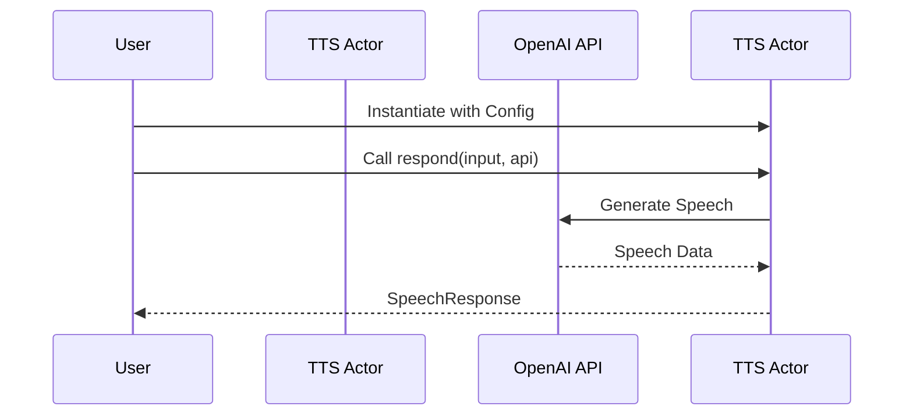
```mermaid
sequenceDiagram
    participant User
    participant TextToSpeechActor as TTS Actor
    participant OpenAIAPI as OpenAI API

    User->>TTS Actor: Instantiate with Config
    User->>TTS Actor: Call respond(input, api)
    TTS Actor->>OpenAIAPI: Generate Speech
    OpenAIAPI-->>TTS Actor: Speech Data
    TTS Actor-->>User: SpeechResponse
```

This diagram illustrates the basic workflow of using `TextToSpeechActor` to convert text to speech. The user instantiates the actor with the desired configuration, calls the `respond` method with input text, and the actor interacts with OpenAI's API to generate and return the speech data.


### Conclusion

The `TextToSpeechActor` class provides a convenient way to integrate text-to-speech functionality into applications using OpenAI's API. By customizing the audio model, voice, and speed, developers can generate speech that fits their specific needs.

# kotlin\com\simiacryptus\skyenet\core\platform\AwsPlatform.kt


## AWS Platform Integration Documentation

The `AwsPlatform` class provides a seamless integration with AWS services, specifically Amazon S3 for object storage and AWS Key Management Service (KMS) for encryption and decryption of data. This document outlines the functionalities provided by the `AwsPlatform` class and how developers can utilize them in their projects.


### Overview

`AwsPlatform` implements the `CloudPlatformInterface`, providing methods to upload data to S3, and to encrypt and decrypt data using AWS KMS. It is designed to be easily integrated into projects requiring cloud storage and data encryption services.


### Initialization

The class is initialized with optional parameters for the S3 bucket name, the base URL for shared resources, and the AWS region. If not specified, default values are used.

```kotlin
val awsPlatform = AwsPlatform(
  bucket = "your-bucket-name",
  shareBase = "https://your-base-url",
  region = Region.US_EAST_1
)
```


### Configuration


#### S3 Client

The S3 client is lazily initialized with the specified region. It is used for all interactions with Amazon S3.


#### KMS Client

Similarly, the KMS client is lazily initialized and is used for encryption and decryption operations. It defaults to the US East (N. Virginia) region.


### Functionalities


#### Upload to S3

The `upload` function is overloaded to support uploading either byte arrays or strings. It constructs the S3 object key from the provided path, ensuring it is properly formatted.

```kotlin
val uploadPath = awsPlatform.upload(
  path = "path/to/object",
  contentType = "application/octet-stream",
  bytes = yourByteArray
)
```


#### Encrypt and Decrypt Data

`encrypt` and `decrypt` functions utilize AWS KMS for data encryption and decryption, respectively. The `encrypt` function requires the key ID for the KMS key, while `decrypt` operates on the encrypted data.

```kotlin
val encryptedData = awsPlatform.encrypt(fileBytes = yourData, keyId = "your-key-id")
val decryptedData = awsPlatform.decrypt(encryptedData = yourEncryptedData)
```


### Error Handling

The class includes a companion object with a logger and a static `get` method that initializes the `AwsPlatform` instance, logging any errors encountered during initialization.


### Mermaid Diagrams


#### Upload Process Flow

```mermaid
sequenceDiagram
    participant Developer
    participant AwsPlatform
    participant S3
    Developer->>AwsPlatform: upload(path, contentType, data)
    AwsPlatform->>S3: PutObjectRequest
    S3-->>AwsPlatform: Success/Failure
    AwsPlatform-->>Developer: shareBase/path
```


#### Encryption/Decryption Flow

```mermaid
sequenceDiagram
    participant Developer
    participant AwsPlatform
    participant KMS
    Developer->>AwsPlatform: encrypt(data, keyId)
    AwsPlatform->>KMS: EncryptRequest
    KMS-->>AwsPlatform: Encrypted Data
    AwsPlatform-->>Developer: Base64 Encoded Data
    Note over Developer,AwsPlatform: Decryption follows a similar flow
```


### Conclusion

The `AwsPlatform` class provides a convenient way to interact with AWS services for storing and securing data. By encapsulating the complexities of AWS SDK calls, it allows developers to focus on their application logic.

# kotlin\com\simiacryptus\skyenet\core\platform\ApplicationServices.kt


## Skyenet Core Platform Developer Documentation

The Skyenet Core Platform provides a comprehensive suite of services and interfaces for managing authentication, authorization, user settings, data storage, and cloud platform interactions. This document outlines the core components and their interactions to aid developers in understanding and extending the platform.


### Overview

The platform is designed around a central `ApplicationServices` object, which acts as a registry for various service interfaces and their implementations. These services include:

- Authentication
- Authorization
- User Settings Management
- Data Storage
- Cloud Platform Interactions

Additionally, the platform provides interfaces for managing sessions, users, and usage metrics.


### Core Components


#### ApplicationServices

`ApplicationServices` is a singleton object that acts as a central registry for all the service interfaces. It ensures that the services are easily accessible throughout the application and enforces a locking mechanism to prevent changes after the application is fully initialized.


##### Key Properties

- `isLocked`: A flag indicating whether the service registry is locked.
- `authorizationManager`: Manages authorization operations.
- `userSettingsManager`: Manages user settings.
- `authenticationManager`: Manages user authentication.
- `dataStorageFactory`: Factory method for creating data storage instances.
- `dataStorageRoot`: The root directory for data storage.
- `clientManager`: Manages client interactions.
- `cloud`: Interface for cloud platform interactions.
- `seleniumFactory`: Factory method for creating Selenium instances.
- `usageManager`: Manages usage metrics.


#### Interfaces


##### AuthenticationInterface

Manages user authentication, including retrieving and storing user information based on access tokens.


##### AuthorizationInterface

Defines operations for checking user authorization for various operations.


##### StorageInterface

Provides methods for storing and retrieving data, including session-specific data and user settings.


##### UserSettingsInterface

Manages user-specific settings, including API keys and base URLs for different API providers.


##### UsageInterface

Tracks and reports usage metrics for different models and API keys.


#### Data Models


##### User

Represents a user with properties such as email, name, ID, and picture.


##### Session

Represents a session with a unique session ID.


#### CloudPlatformInterface

Defines methods for interacting with cloud platforms, including uploading files and encrypting/decrypting data.


### Diagrams


#### ApplicationServices and Interfaces Interaction

```mermaid
classDiagram
    ApplicationServices --|> AuthenticationInterface
    ApplicationServices --|> AuthorizationInterface
    ApplicationServices --|> UserSettingsInterface
    ApplicationServices --|> StorageInterface
    ApplicationServices --|> UsageInterface
    ApplicationServices --|> CloudPlatformInterface
    class ApplicationServices{
      +Boolean isLocked
      +AuthorizationInterface authorizationManager
      +UserSettingsInterface userSettingsManager
      +AuthenticationInterface authenticationManager
      +Function dataStorageFactory
      +File dataStorageRoot
      +ClientManager clientManager
      +CloudPlatformInterface cloud
      +Function seleniumFactory
      +UsageInterface usageManager
    }
    class AuthenticationInterface{
      +getUser(String)
      +putUser(String, User)
      +logout(String, User)
    }
    class AuthorizationInterface{
      +isAuthorized(Class, User, OperationType)
    }
    class UserSettingsInterface{
      +getUserSettings(User)
      +updateUserSettings(User, UserSettings)
    }
    class StorageInterface{
      +getJson(User, Session, String, Class)
      +getMessages(User, Session)
      +getSessionDir(User, Session)
      +listSessions(User)
      +setJson(User, Session, String, Any)
      +updateMessage(User, Session, String, String)
    }
    class UsageInterface{
      +incrementUsage(Session, User, OpenAIModel, ApiModel.Usage)
      +getUserUsageSummary(User)
      +getSessionUsageSummary(Session)
      +clear()
    }
    class CloudPlatformInterface{
      +upload(String, String, ByteArray)
      +encrypt(ByteArray, String)
      +decrypt(ByteArray)
    }
```

This diagram illustrates the relationship between the `ApplicationServices` singleton and the various service interfaces it manages. It also shows the key methods provided by each interface.


### Conclusion

The Skyenet Core Platform provides a robust foundation for managing authentication, authorization, user settings, data storage, and cloud interactions. By understanding the core components and their interactions, developers can effectively extend and customize the platform to meet their specific needs.

# kotlin\com\simiacryptus\skyenet\core\platform\file\AuthenticationManager.kt


## AuthenticationManager Class Documentation

The `AuthenticationManager` class is a part of the `com.simiacryptus.skyenet.core.platform.file` package and is responsible for managing user authentication within the system. It implements the `AuthenticationInterface`, providing concrete implementations for user authentication, addition, and logout functionalities.


### Class Diagram

```mermaid
classDiagram
    class AuthenticationManager {
        -HashMap<String, User> users
        +getUser(String accessToken) User
        +putUser(String accessToken, User user) User
        +logout(String accessToken, User user) void
    }
    AuthenticationInterface <|.. AuthenticationManager : implements
```


### Class Members


#### Properties

- `private val users: HashMap<String, User>`: A private hashmap that stores user objects against their access tokens as keys.


#### Methods


##### getUser(accessToken: String?): User?

- **Description**: Retrieves a `User` object associated with the given access token.
- **Parameters**:
  - `accessToken: String?`: The access token used to identify the user. Can be `null`.
- **Returns**: The `User` object if found; otherwise, `null`.
- **Usage Example**:

```kotlin
val user = authenticationManager.getUser("someAccessToken")
```


##### putUser(accessToken: String, user: User): User

- **Description**: Adds or updates a user in the system with the given access token.
- **Parameters**:
  - `accessToken: String`: The access token to associate with the user.
  - `user: User`: The user object to add or update.
- **Returns**: The `User` object that was added or updated.
- **Usage Example**:

```kotlin
val newUser = User("JohnDoe", "john@example.com")
authenticationManager.putUser("newAccessToken", newUser)
```


##### logout(accessToken: String, user: User)

- **Description**: Logs out a user from the system by removing the association between the user and the access token.
- **Parameters**:
  - `accessToken: String`: The access token of the user to log out.
  - `user: User`: The user object to log out.
- **Preconditions**: The user associated with the given access token must match the user object provided; otherwise, an exception is thrown.
- **Usage Example**:

```kotlin
authenticationManager.logout("existingAccessToken", existingUser)
```


### Sequence Diagram for User Logout

```mermaid
sequenceDiagram
    participant Client
    participant AuthenticationManager
    Client->>AuthenticationManager: logout(accessToken, user)
    alt valid user and token
        AuthenticationManager->>AuthenticationManager: remove user from users
        AuthenticationManager-->>Client: success
    else invalid user or token
        AuthenticationManager-->>Client: throw exception
    end
```

This documentation provides an overview of the `AuthenticationManager` class, its properties, methods, and how it interacts with other components for managing user authentication within the system.

# kotlin\com\simiacryptus\skyenet\core\platform\ClientManager.kt


## Developer Documentation for ClientManager

The `ClientManager` class is a core component designed to manage OpenAI client instances and thread pools for sessions and users within an application. It provides mechanisms to create and retrieve `OpenAIClient` instances and `ThreadPoolExecutor` instances based on session and user context. This document outlines the structure and functionality of the `ClientManager` class and its inner classes.


### Overview

The `ClientManager` class primarily deals with two types of resources:

1. **OpenAIClient Instances**: Handles communication with OpenAI's API, customized with user-specific API keys and logging configurations.
2. **ThreadPoolExecutor Instances**: Manages a pool of threads for executing tasks asynchronously, tailored for specific sessions and users.


### Class Diagram

```mermaid
classDiagram
    class ClientManager {
        -clientCache: Map
        -poolCache: Map
        +getClient(session, user, dataStorage): OpenAIClient
        +getPool(session, user, dataStorage): ThreadPoolExecutor
        -createClient(session, user, dataStorage): OpenAIClient
        -createPool(session, user, dataStorage): ThreadPoolExecutor
    }
    class SessionKey {
        -session: Session
        -user: User
    }
    class RecordingThreadFactory {
        -inner: ThreadFactory
        -threads: Set
        +newThread(r): Thread
    }
    class MonitoredClient {
        -budget: Double
        +authorize(request, apiProvider): void
        +onUsage(model, tokens): void
    }
    ClientManager --> SessionKey : uses
    ClientManager --> RecordingThreadFactory : uses
    ClientManager --> MonitoredClient : creates
```


### Key Components


#### ClientManager

- **Purpose**: Manages `OpenAIClient` and `ThreadPoolExecutor` instances.
- **Key Methods**:
  - `getClient(session, user, dataStorage)`: Retrieves or creates an `OpenAIClient` instance.
  - `getPool(session, user, dataStorage)`: Retrieves or creates a `ThreadPoolExecutor` instance.


#### SessionKey

- **Purpose**: Acts as a unique identifier for caching clients and pools based on session and user.
- **Fields**:
  - `session`: The current session.
  - `user`: The current user (optional).


#### RecordingThreadFactory

- **Purpose**: Custom `ThreadFactory` that names threads based on session and user, and keeps track of created threads.
- **Key Method**:
  - `newThread(r)`: Creates a new thread for the runnable `r`, names it, and adds it to the set of threads.


#### MonitoredClient

- **Purpose**: Extends `OpenAIClient` to add usage monitoring and budget enforcement based on session and user.
- **Key Features**:
  - Budget tracking and enforcement.
  - Custom authorization and usage logging.


### Usage Flow

1. **Client Retrieval**: When a client is requested via `getClient`, the `ClientManager` checks the cache. If a client does not exist, it creates one using `createClient`.
2. **Pool Retrieval**: Similarly, when a thread pool is requested via `getPool`, it either retrieves an existing pool from the cache or creates a new one using `createPool`.
3. **Client Creation**: `createClient` may create a `MonitoredClient` instance, which is customized with user-specific API keys and logging configurations.
4. **Pool Creation**: `createPool` initializes a `ThreadPoolExecutor` with a `RecordingThreadFactory` to manage thread naming and tracking.


### Conclusion

The `ClientManager` class provides a structured way to manage OpenAI client instances and thread pools within an application, ensuring that resources are efficiently reused and customized according to session and user contexts.

# kotlin\com\simiacryptus\skyenet\core\platform\file\AuthorizationManager.kt


## AuthorizationManager Class Documentation

The `AuthorizationManager` class is an implementation of the `AuthorizationInterface` designed to manage user authorization for different operations within an application. It provides a mechanism to check if a user is authorized to perform a specific operation either globally or within the context of a specific application class.


### Class Overview

```mermaid
classDiagram
    AuthorizationInterface <|-- AuthorizationManager
    AuthorizationManager : +isAuthorized(applicationClass, user, operationType)
    AuthorizationManager : -isUserAuthorized(permissionPath, user)
    AuthorizationManager : +matches(user, line)
    AuthorizationManager : -log
```


#### Methods


##### `isAuthorized(applicationClass: Class<*>?, user: User?, operationType: AuthorizationInterface.OperationType): Boolean`

Checks if a user is authorized to perform a specific operation. It first checks global permissions and then, if necessary, checks permissions specific to the application class.

- **Parameters:**
  - `applicationClass`: The class of the application for which the authorization is being checked. It can be `null` if the check is global.
  - `user`: The user for whom the authorization is being checked.
  - `operationType`: The type of operation for which authorization is being checked.
- **Returns:** `true` if the user is authorized, otherwise `false`.


##### `isUserAuthorized(permissionPath: String, user: User?): Boolean` (Private)

Checks if a user is authorized based on permissions defined in a file located at the specified path.

- **Parameters:**
  - `permissionPath`: The path to the permissions file.
  - `user`: The user for whom the authorization is being checked.
- **Returns:** `true` if the user is found in the permissions file, otherwise `false`.


##### `matches(user: User?, line: String): Boolean` (Open)

Determines if a line from a permissions file matches the user's email or domain.

- **Parameters:**
  - `user`: The user for whom the match is being checked.
  - `line`: A line from the permissions file.
- **Returns:** `true` if the line matches the user's email or domain, otherwise `false`.


#### Usage Example

```kotlin
val authorizationManager = AuthorizationManager()
val user = User(email = "example@example.com")
val operationType = AuthorizationInterface.OperationType.READ

// Check global authorization
val isGloballyAuthorized = authorizationManager.isAuthorized(null, user, operationType)

// Check authorization for a specific class
val isClassAuthorized = authorizationManager.isAuthorized(MyApplicationClass::class.java, user, operationType)
```


#### Error Handling

The `isAuthorized` method is designed to catch and log any exceptions that occur during the authorization check process. If an exception is caught, the method will return `false`, indicating that the user is not authorized.


#### Logging

The `AuthorizationManager` utilizes SLF4J for logging. It logs debug information about authorization checks and errors.


### Conclusion

The `AuthorizationManager` class provides a flexible and extensible way to manage user authorizations. By leveraging permissions files, it allows for granular control over who can perform specific operations, either globally or within the context of a particular application class.

# kotlin\com\simiacryptus\skyenet\core\platform\file\DataStorage.kt


## DataStorage Class Documentation

The `DataStorage` class is part of the `com.simiacryptus.skyenet.core.platform.file` package and implements the `StorageInterface`. It provides functionalities for managing session-based data storage, including operations for JSON data manipulation, message handling, and session management within a file system.


### Overview

The class is designed to work with a directory structure that segregates data by user and session. It supports operations such as reading and writing JSON data, listing and managing messages within sessions, and handling session directories and names.


### Class Diagram

```mermaid
classDiagram
    StorageInterface <|-- DataStorage
    StorageInterface : +getJson()
    StorageInterface : +getMessages()
    StorageInterface : +getSessionDir()
    StorageInterface : +getSessionName()
    StorageInterface : +getMessageIds()
    StorageInterface : +setMessageIds()
    StorageInterface : +getSessionTime()
    StorageInterface : +listSessions()
    StorageInterface : +setJson()
    StorageInterface : +updateMessage()
    StorageInterface : +deleteSession()
    DataStorage : -dataDir File
    DataStorage : +getJson()
    DataStorage : -getJson()
    DataStorage : +getMessages()
    DataStorage : +getSessionDir()
    DataStorage : +getSessionName()
    DataStorage : +getMessageIds()
    DataStorage : +setMessageIds()
    DataStorage : +getSessionTime()
    DataStorage : -messageFiles()
    DataStorage : +listSessions()
    DataStorage : +setJson()
    DataStorage : +updateMessage()
    DataStorage : +addMessageID()
    DataStorage : +listSessions()
    DataStorage : +userRoot()
    DataStorage : +deleteSession()
```


### Key Methods


#### JSON Data Management

- `getJson`: Retrieves a JSON object from a specified file within a session directory and deserializes it into the specified class type.
- `setJson`: Serializes and saves a given object as JSON into a specified file within a session directory.


#### Message Handling

- `getMessages`: Retrieves all messages for a given session as a `LinkedHashMap` where keys are message IDs and values are message contents.
- `updateMessage`: Updates or creates a message with a given ID for a specified session.
- `addMessageID`: Adds a new message ID to the list of message IDs for a given session.


#### Session Management

- `getSessionDir`: Determines the directory path for a given session based on its ID and potentially the user.
- `getSessionName`: Retrieves or generates a name for a given session.
- `getMessageIds`: Retrieves a list of message IDs for a given session.
- `setMessageIds`: Sets the list of message IDs for a given session.
- `getSessionTime`: Retrieves or calculates the time associated with a given session.
- `listSessions`: Lists all sessions available within a specified directory or globally/user-specific based on the context.


#### Utility Methods

- `userRoot`: Determines the root directory for a given user's data.
- `deleteSession`: Deletes all data associated with a given session.


### Usage Example

To use the `DataStorage` class, you must first instantiate it with a reference to the root directory where session data will be stored. From there, you can call its methods to manage session data as needed.

```kotlin
val dataStorage = DataStorage(File("/path/to/data"))
val user = User("user@example.com")
val session = Session("G-20230101-123456")

// Retrieve session directory
val sessionDir = dataStorage.getSessionDir(user, session)

// Update a message
dataStorage.updateMessage(user, session, "messageId", "Hello, World!")

// Get all messages for a session
val messages = dataStorage.getMessages(user, session)
```


### Conclusion

The `DataStorage` class provides a comprehensive interface for managing session-based data storage in a file system, making it easier to handle user and session-specific data in a structured and organized manner.

# kotlin\com\simiacryptus\skyenet\core\platform\file\UserSettingsManager.kt


## UserSettingsManager Class Documentation

The `UserSettingsManager` class is a part of the `com.simiacryptus.skyenet.core.platform.file` package and implements the `UserSettingsInterface`. It is designed to manage user settings, providing functionalities to retrieve and update settings for users. The settings are stored in JSON format in a designated directory on the file system.


### Class Overview

```mermaid
classDiagram
    class UserSettingsManager {
        -HashMap<User, UserSettings> userSettings
        -File userConfigDirectory
        +getUserSettings(User) UserSettings
        +updateUserSettings(User, UserSettings) void
    }
    UserSettingsManager ..|> UserSettingsInterface : implements
```


### Properties

- `userSettings`: A private HashMap that caches the user settings in memory to avoid frequent file system access.
- `userConfigDirectory`: A private File object representing the directory where user settings files are stored.


### Methods


#### getUserSettings

```kotlin
fun getUserSettings(user: User): UserSettings
```

Retrieves the `UserSettings` for a given `User`. If the settings for the user are not found in the cache (`userSettings`), it attempts to load them from a JSON file in the `userConfigDirectory`. If the file does not exist or an error occurs during loading, it creates and returns new default `UserSettings`.


##### Parameters

- `user`: The `User` object for whom the settings are to be retrieved.


##### Returns

- `UserSettings`: The user settings for the specified user.


#### updateUserSettings

```kotlin
fun updateUserSettings(user: User, settings: UserSettings)
```

Updates the settings for a given user both in the cache (`userSettings`) and in the file system by writing the settings to a JSON file in the `userConfigDirectory`.


##### Parameters

- `user`: The `User` object for whom the settings are to be updated.
- `settings`: The `UserSettings` object containing the new settings for the user.


### Usage Example

```kotlin
val userManager = UserSettingsManager()
val user = User("exampleUser")
val settings = userManager.getUserSettings(user) // Retrieves or creates new settings
settings.someSetting = newValue // Modify settings as needed
userManager.updateUserSettings(user, settings) // Updates the settings in memory and file
```


### File Structure

The user settings are stored in JSON files within the `.skyenet/users` directory. Each user has a separate file named after their username with a `.json` extension, e.g., `exampleUser.json`.


### Logging

The `UserSettingsManager` utilizes SLF4J for logging purposes. It logs information about loading, creating, and updating user settings, as well as warnings in case of errors during these operations.

---

This documentation provides a comprehensive overview of the `UserSettingsManager` class, its functionalities, and usage within the system for managing user settings.

# kotlin\com\simiacryptus\skyenet\core\platform\file\UsageManager.kt


## UsageManager Class Documentation

The `UsageManager` class is part of the `com.simiacryptus.skyenet.core.platform.file` package and implements the `UsageInterface`. It is designed to manage and track the usage of various OpenAI models by different users and sessions, logging this information for monitoring and billing purposes.


### Overview

The class provides functionality to increment usage counters, retrieve usage summaries for users and sessions, and manage the persistence of this data through logging to files.


### Class Diagram

```mermaid
classDiagram
    UsageInterface <|-- UsageManager
    UsageManager : +File root
    UsageManager : -FileWriter txLogFileWriter
    UsageManager : -ConcurrentHashMap usagePerSession
    UsageManager : -ConcurrentHashMap sessionsByUser
    UsageManager : -ConcurrentHashMap usersBySession
    UsageManager : +incrementUsage(Session, String, OpenAIModel, ApiModel.Usage)
    UsageManager : +getUserUsageSummary(String) Map
    UsageManager : +getSessionUsageSummary(Session) Map
    UsageManager : +clear()
```


### Key Components

- **root**: The root directory where usage logs and other related files are stored.
- **txLogFileWriter**: A `FileWriter` used to write transaction logs to a CSV file.
- **usagePerSession**: A concurrent hash map tracking usage counters per session.
- **sessionsByUser**: A concurrent hash map associating users with their sessions.
- **usersBySession**: A concurrent hash map associating sessions with their users.


### Methods


#### incrementUsage

Increments the usage counters for a given session, user, and model. This method also logs the transaction to a CSV file.

**Parameters:**
- `session`: The session for which usage is being incremented.
- `apiKey`: The API key (or user identifier) associated with the usage.
- `model`: The OpenAI model being used.
- `tokens`: An instance of `com.simiacryptus.jopenai.ApiModel.Usage` detailing the usage metrics.


#### getUserUsageSummary

Retrieves a summary of usage for a given user across all sessions.

**Parameters:**
- `apiKey`: The API key (or user identifier) for which to retrieve the usage summary.

**Returns:** A map of `OpenAIModel` to `com.simiacryptus.jopenai.ApiModel.Usage` summarizing the usage.


#### getSessionUsageSummary

Retrieves a summary of usage for a given session.

**Parameters:**
- `session`: The session for which to retrieve the usage summary.

**Returns:** A map of `OpenAIModel` to `com.simiacryptus.jopenai.ApiModel.Usage` summarizing the usage.


#### clear

Clears all usage counters and associated mappings, and logs the current state before clearing.


### Persistence Mechanism

The `UsageManager` class employs a file-based logging mechanism to persist usage data. This includes a CSV file for transaction logs and a JSON file for counter states. The class also implements a scheduled task to periodically save the counters to disk.


### Sequence Diagram for incrementUsage

```mermaid
sequenceDiagram
    participant Client
    participant UsageManager
    participant FileWriter
    Client->>UsageManager: incrementUsage(session, apiKey, model, tokens)
    UsageManager->>FileWriter: Write transaction to log
    FileWriter->>UsageManager: Flush to disk
```


### Usage Example

```kotlin
val rootDir = File("/path/to/usage/logs")
val usageManager = UsageManager(rootDir)
val session = Session("session-id")
val user = "user@example.com"
val model = OpenAIModel.ChatGPT
val usage = ApiModel.Usage(prompt_tokens = 100, completion_tokens = 50)

usageManager.incrementUsage(session, user, model, usage)
```

This documentation provides an overview of the `UsageManager` class, its key components, and how it can be used to track and manage usage of OpenAI models.

# kotlin\com\simiacryptus\skyenet\core\platform\test\AuthorizationInterfaceTest.kt


## Developer Documentation: AuthorizationInterfaceTest


### Overview

The `AuthorizationInterfaceTest` class is designed to test the authorization functionalities provided by the `AuthorizationInterface`. It aims to ensure that the authorization checks behave as expected for different users and operations within the system. This documentation provides an overview of the `AuthorizationInterfaceTest` class, its structure, and how it is used to validate authorization logic.


### Class Structure

The `AuthorizationInterfaceTest` class is an open class that requires an instance of `AuthorizationInterface` as a constructor parameter. This design allows for testing different implementations of the `AuthorizationInterface`. The class contains a predefined `user` object and a test method named `newUser has admin`.


#### User Object

The `user` object is an instance of the `User` class with predefined attributes:

- **Email**: newuser@example.com
- **Name**: Jane Smith
- **ID**: 2
- **Picture URL**: http://example.com/newpicture.jpg

This user object represents a new user in the system and is used to test authorization checks.


#### Test Method: `newUser has admin`

The test method `newUser has admin` is designed to verify that a new user does not have administrative privileges by default. It uses the `assertFalse` assertion to ensure that the `isAuthorized` method of the `AuthorizationInterface` returns `false` when checking if the predefined `user` has `Admin` operation type access.


### Sequence Diagram

The following sequence diagram illustrates the flow of the `newUser has admin` test method:

```mermaid
sequenceDiagram
    participant Test as AuthorizationInterfaceTest
    participant AuthInterface as AuthorizationInterface
    Test->>AuthInterface: isAuthorized(this.javaClass, user, OperationType.Admin)
    AuthInterface-->>Test: false
    Test->>Test: assertFalse(result)
```


### Usage

To use the `AuthorizationInterfaceTest` class for testing, follow these steps:

1. Implement the `AuthorizationInterface` with your custom authorization logic.
2. Instantiate your implementation of `AuthorizationInterface`.
3. Create an instance of `AuthorizationInterfaceTest`, passing your `AuthorizationInterface` implementation to its constructor.
4. Run the `newUser has admin` test method to verify that new users do not have administrative privileges by default.


### Conclusion

The `AuthorizationInterfaceTest` class is a crucial component for ensuring that the authorization logic in your application behaves as expected. By testing with predefined user objects and specific operation types, you can validate the security and correctness of your authorization checks.

# kotlin\com\simiacryptus\skyenet\core\platform\test\AuthenticationInterfaceTest.kt


## Authentication Interface Test Documentation

This documentation provides an overview of the `AuthenticationInterfaceTest` class, which is designed to test the functionality of an `AuthenticationInterface` implementation. The tests ensure that the interface correctly handles user authentication processes, including adding, retrieving, and removing users based on access tokens.


### Overview

The `AuthenticationInterfaceTest` class is an open class that requires an instance of `AuthenticationInterface` to be passed to its constructor. This design allows for testing different implementations of the `AuthenticationInterface`. The class includes several test methods annotated with `@Test`, each designed to verify a specific aspect of the authentication process.


### Test Methods

The class contains the following test methods:

- `getUser should return null when no user is associated with access token`
- `putUser should add a new user and return the user`
- `getUser should return User after putUser is called`
- `logout should remove the user associated with the access token`


#### Diagram: Test Flow

```mermaid
sequenceDiagram
    participant Test as Test Case
    participant Auth as AuthenticationInterface

    Note over Test, Auth: getUser with no associated user
    Test->>Auth: getUser(validAccessToken)
    Auth-->>Test: null

    Note over Test, Auth: putUser adds a new user
    Test->>Auth: putUser(validAccessToken, newUser)
    Auth-->>Test: newUser

    Note over Test, Auth: getUser returns added user
    Test->>Auth: getUser(validAccessToken)
    Auth-->>Test: newUser

    Note over Test, Auth: logout removes the user
    Test->>Auth: logout(validAccessToken, newUser)
    Test->>Auth: getUser(validAccessToken)
    Auth-->>Test: null
```


### Test Setup

Before running the tests, an instance of `AuthenticationInterface` must be provided. This instance is used to perform the actual authentication operations tested by the methods.


#### Key Variables

- `validAccessToken`: A randomly generated UUID string used as a mock access token for testing.
- `newUser`: A mock `User` object representing a new user to be added through the authentication interface.


### Test Methods Explained


#### `getUser should return null when no user is associated with access token`

This test verifies that the `getUser` method returns `null` when queried with an access token that has no associated user.


#### `putUser should add a new user and return the user`

This test checks if the `putUser` method correctly adds a new user associated with a given access token and returns the added user object.


#### `getUser should return User after putUser is called`

This test ensures that after a new user is added with `putUser`, the `getUser` method can retrieve the user object when provided with the same access token.


#### `logout should remove the user associated with the access token`

This test confirms that the `logout` method removes the association between the user and the access token, resulting in `getUser` returning `null` for that token.


### Conclusion

The `AuthenticationInterfaceTest` class provides a comprehensive suite of tests to ensure the correct behavior of implementations of the `AuthenticationInterface`. By following the test cases and ensuring all pass, developers can be confident in the reliability and correctness of their authentication processes.

# kotlin\com\simiacryptus\skyenet\core\platform\test\UsageTest.kt


## Developer Documentation for `UsageTest` Class

The `UsageTest` class is an abstract test suite designed to validate the functionality of implementations of the `UsageInterface`. This interface is crucial for tracking and managing the usage of resources by users, particularly in applications that involve session-based interactions and resource consumption tracking.


### Overview

The `UsageTest` class focuses on testing the ability of an implementation to accurately record and report usage statistics for individual sessions and users. It leverages a test user and predefined usage metrics to ensure that the `incrementUsage` method correctly updates the usage records.


### Class Diagram

```mermaid
classDiagram
    class UsageTest {
      -impl: UsageInterface
      -testUser: User
      +UsageTest(impl: UsageInterface)
      +incrementUsage should increment usage for session(): void
    }
    class UsageInterface {
      +incrementUsage(session: String, user: User, model: ApiModel, usage: ApiModel.Usage): void
      +getSessionUsageSummary(session: String): Map~ApiModel, ApiModel.Usage~
      +getUserUsageSummary(user: User): Map~ApiModel, ApiModel.Usage~
    }
    class User {
      +email: String
      +name: String
      +id: String
    }
    class ApiModel {
      <<enumeration>>
      GPT35Turbo
    }
    class ApiModel.Usage {
      +prompt_tokens: Int
      +completion_tokens: Int
      +cost: Double
    }
    UsageTest --> UsageInterface : uses
    UsageTest --> User : uses
    UsageInterface --> ApiModel : uses
    UsageInterface --> ApiModel.Usage : uses
```


### Test Method: `incrementUsage should increment usage for session`

This test method validates the functionality of the `incrementUsage` method within the `UsageInterface`. It follows these steps:

1. **Setup**: A test user is created with predefined attributes. A session ID is generated using `StorageInterface.newGlobalID()`. A predefined usage object is created to simulate the consumption of resources.

2. **Action**: The `incrementUsage` method of the `UsageInterface` implementation is called with the session ID, test user, a model (in this case, `OpenAIModels.GPT35Turbo`), and the predefined usage object.

3. **Verification**:
    - The method `getSessionUsageSummary` is called with the session ID to retrieve the usage summary for the session. The test verifies that the returned usage summary matches the predefined usage object.
    - The method `getUserUsageSummary` is called with the test user to retrieve the user's usage summary. The test verifies that the returned usage summary for the user matches the predefined usage object.


### Sequence Diagram for `incrementUsage should increment usage for session`

```mermaid
sequenceDiagram
    participant Test as UsageTest
    participant Interface as UsageInterface
    participant Storage as StorageInterface
    participant Model as ApiModel

    Test->>Storage: newGlobalID()
    Note over Test: Generate session ID
    Test->>Interface: incrementUsage(session, testUser, GPT35Turbo, usage)
    Note over Interface: Update usage records
    Test->>Interface: getSessionUsageSummary(session)
    Interface->>Test: Return usage summary for session
    Test->>Interface: getUserUsageSummary(testUser)
    Interface->>Test: Return usage summary for user
    Note over Test: Verify usage summaries match predefined usage
```


### Conclusion

The `UsageTest` class provides a structured approach to validate the implementation of the `UsageInterface`. By ensuring that usage statistics are accurately recorded and reported, developers can maintain the integrity of resource management and usage tracking within their applications.

# kotlin\com\simiacryptus\skyenet\core\platform\test\UserSettingsTest.kt


## Developer Documentation: UserSettingsTest

The `UserSettingsTest` class is designed to validate the functionality of user settings management within a platform. It ensures that custom settings for a user can be updated and retrieved accurately. This documentation provides an overview of the test cases and their significance in maintaining the integrity of the user settings feature.


### Overview

`UserSettingsTest` is an abstract class that requires an implementation of `UserSettingsInterface` to be passed to its constructor. This design allows for testing different implementations of `UserSettingsInterface` with the same set of tests.


### Test Cases


#### 1. `updateUserSettings should store custom settings for user`

This test verifies that the `updateUserSettings` method correctly stores custom settings for a user. It involves creating a test user, updating their settings, and then retrieving the settings to ensure they have been updated as expected.


##### Process Flow

```mermaid
sequenceDiagram
    participant Test
    participant UserSettings
    Test->>+UserSettings: updateUserSettings(testUser, newSettings)
    UserSettings-->>-Test: Update Complete
    Test->>+UserSettings: getUserSettings(testUser)
    UserSettings-->>-Test: Return settings
    Test->>Test: Assert settings are updated
```


#### 2. `getUserSettings should return updated settings after updateUserSettings is called`

This test ensures that after updating a user's settings, the `getUserSettings` method returns the updated settings. It checks the initial state of a user's settings, updates the settings, and then verifies that the new settings are returned upon retrieval.


##### Process Flow

```mermaid
sequenceDiagram
    participant Test
    participant UserSettings
    Test->>+UserSettings: getUserSettings(testUser)
    UserSettings-->>-Test: Return initial settings
    Test->>Test: Assert initial settings
    Test->>+UserSettings: updateUserSettings(testUser, updatedSettings)
    UserSettings-->>-Test: Update Complete
    Test->>+UserSettings: getUserSettings(testUser)
    UserSettings-->>-Test: Return updated settings
    Test->>Test: Assert updated settings
```


### Key Components

- **User**: Represents a user in the system. Each user has an email, name, and ID.
- **UserSettingsInterface**: An interface defining methods for updating and retrieving user settings.
  - `updateUserSettings(User, UserSettings)`: Updates the settings for a given user.
  - `getUserSettings(User)`: Retrieves the settings for a given user.
- **UserSettingsInterface.UserSettings**: A data class representing user settings. It includes a map of API keys associated with different API providers.


### Conclusion

The `UserSettingsTest` class plays a crucial role in ensuring the reliability of the user settings management feature. By abstracting the `UserSettingsInterface`, it allows for flexible testing across different implementations, ensuring that user settings are correctly updated and retrieved across the platform.

# kotlin\com\simiacryptus\skyenet\core\platform\test\StorageInterfaceTest.kt


## StorageInterfaceTest Developer Documentation

The `StorageInterfaceTest` class is an abstract test suite designed to verify the functionality of implementations of the `StorageInterface`. This documentation provides an overview of the test methods available in the class and how they interact with the `StorageInterface`.


### Overview

The `StorageInterface` is a critical component that abstracts storage operations for sessions, messages, and user-specific data. Implementations of this interface must provide mechanisms to handle data storage and retrieval in a consistent and reliable manner.

The `StorageInterfaceTest` class ensures that any implementation of the `StorageInterface` adheres to the expected behavior through a series of unit tests. Each test is designed to validate specific functionalities such as session management, message handling, and JSON data operations.


### Test Methods

Below is a summary of the test methods included in the `StorageInterfaceTest` class:

- `testGetJson()`: Validates retrieval of JSON data.
- `testGetMessages()`: Checks the retrieval of messages as a `LinkedHashMap`.
- `testGetSessionDir()`: Ensures the session directory is correctly obtained.
- `testGetSessionName()`: Verifies that the session name is correctly retrieved.
- `testGetSessionTime()`: Confirms that the session time is correctly fetched.
- `testListSessions()`: Tests listing of all sessions for a user.
- `testSetJson()`: Validates setting JSON data.
- `testUpdateMessage()`: Checks updating of a message.
- `testListSessionsWithDir()`: Tests listing of sessions from a specific directory.
- `testUserRoot()`: Verifies retrieval of the user's root directory.
- `testDeleteSession()`: Ensures that a session can be deleted without errors.


### Workflow Diagram

To better understand the interactions between the tests and the `StorageInterface`, the following Mermaid.js diagram illustrates a simplified workflow for a few selected test cases:

```mermaid
sequenceDiagram
    participant T as Test
    participant S as StorageInterface
    participant D as Data Storage

    T->>S: testGetJson()
    S->>D: Fetch JSON
    D-->>S: Return JSON
    S-->>T: Assert NULL (non-existing)

    T->>S: testSetJson()
    S->>D: Store JSON
    D-->>S: Confirm
    S-->>T: Assert Equal (settings)

    T->>S: testDeleteSession()
    S->>D: Delete Session Data
    D-->>S: Confirm Deletion
    S-->>T: Assert No Exception
```


### Testing Strategy

Each test method follows a similar structure:

1. **Arrange**: Set up any necessary objects and state before the actual test.
2. **Act**: Execute the method under test with the arranged conditions.
3. **Assert**: Verify that the outcome of the action is as expected.

This structure ensures that each test is isolated, focusing on a single behavior of the `StorageInterface`.


### Extending Tests

To extend the `StorageInterfaceTest` with additional tests for new methods in the `StorageInterface`, follow these steps:

1. **Define the Test Method**: Create a new `@Test` method in the `StorageInterfaceTest` class.
2. **Arrange**: Set up the necessary preconditions for your test.
3. **Act**: Call the method under test.
4. **Assert**: Verify the outcome against the expected result.

Ensure that each new test method adheres to the testing strategy outlined above to maintain consistency and clarity in the test suite.


### Conclusion

The `StorageInterfaceTest` class provides a comprehensive suite of tests to ensure the reliability and correctness of `StorageInterface` implementations. By following the testing strategy and extending the test suite as needed, developers can ensure that their storage solutions meet the required standards for functionality and robustness.

# kotlin\com\simiacryptus\skyenet\core\util\ClasspathRelationships.kt


## ClasspathRelationships Module Documentation

The `ClasspathRelationships` module is part of the `com.simiacryptus.skyenet.core.util` package. It provides utilities for analyzing and managing relationships between classes within Java Archive (JAR) files. This documentation outlines the key functionalities provided by this module, including reading classes from JAR files, listing files within a JAR, and mapping class dependencies.


### Overview

The module consists of the `ClasspathRelationships` object, which contains methods for working with JAR files and a data class for representing references or relationships between classes.


#### Key Components

- **Relation**: A sealed class representing a generic relationship between two methods. It has two open properties, `from_method` and `to_method`, which denote the source and target of the relationship, respectively.
- **Reference**: A data class that encapsulates a relationship between two classes (`from` and `to`) along with the specific `relation` between them.
- **Utility Functions**: Functions for reading classes and files from JAR archives and for mapping class dependencies.


### Functions


#### readJarClasses

```kotlin
fun readJarClasses(jarPath: String): Map<String, ByteArray?>
```

Reads and returns all classes from a specified JAR file. Each class is represented by its fully qualified name and its bytecode in the form of a `ByteArray`.


##### Parameters

- `jarPath`: The file system path to the JAR file.


##### Returns

- A `Map` where each key is a fully qualified class name and each value is the class's bytecode as a `ByteArray`.


#### readJarFiles

```kotlin
fun readJarFiles(jarPath: String): Array<String>
```

Lists all files contained within a specified JAR file.


##### Parameters

- `jarPath`: The file system path to the JAR file.


##### Returns

- An `Array` of `String` containing the names of all files within the JAR file.


#### downstreamMap

```kotlin
fun downstreamMap(dependencies: List<Reference>): Map<String, List<Reference>>
```

Groups a list of `Reference` objects by their source class (`from`).


##### Parameters

- `dependencies`: A list of `Reference` objects representing class dependencies.


##### Returns

- A `Map` where each key is a class name and each value is a list of `Reference` objects originating from that class.


### Diagrams

To better understand the relationships and functionalities provided by this module, the following Mermaid.js diagrams can be used:


#### Class Relationships

```mermaid
classDiagram
    class Relation {
        <<abstract>>
        +String from_method
        +String to_method
    }
    class Reference {
        +String from
        +String to
        +Relation relation
    }
    Relation <|-- Reference : has
```

This diagram illustrates the relationship between the `Relation` and `Reference` classes. `Reference` has a `Relation` indicating the type of relationship between two classes.


#### Functionality Overview

```mermaid
graph LR
    A[readJarClasses] --> B((JAR File))
    C[readJarFiles] --> B
    D[downstreamMap] --> E{References}
```

This diagram shows how the main functions interact with JAR files and references between classes.


### Conclusion

The `ClasspathRelationships` module provides essential utilities for analyzing class dependencies within JAR files, making it a valuable tool for developers working with Java applications. By leveraging the functionalities provided, developers can gain insights into the structure and relationships of classes in their applications.

# kotlin\com\simiacryptus\skyenet\core\util\Ears.kt


## Ears Class Documentation

The `Ears` class serves as the auditory interface for the SkyeNet system, facilitating audio input processing, command recognition, and dictation. It leverages the OpenAI API for audio transcription and command recognition.


### Overview

The `Ears` class is designed to capture audio input, transcribe it into text, and recognize specific commands within the transcribed text. It utilizes several components from the `com.simiacryptus.jopenai` package to achieve this functionality, including audio recording, loudness window buffering, and transcription processing.


### Class Diagram

```mermaid
classDiagram
    class Ears {
        +OpenAIClient api
        +Double secondsPerAudioPacket
        +CommandRecognizer commandRecognizer
        +timeout(ms: Long): () -> Boolean
        +listenForCommand(client: OpenAIClient, minCaptureMs: Int, continueFn: () -> Boolean, rawBuffer: Deque~ByteArray~, commandHandler: (command: String) -> Unit)
        +startDictationListener(client: OpenAIClient, continueFn: () -> Boolean, rawBuffer: Deque~ByteArray~, textAppend: (String) -> Unit)
        +startAudioCapture(continueFn: () -> Boolean): ConcurrentLinkedDeque~ByteArray~
    }
    Ears --> "1" CommandRecognizer: Uses
```


### Key Components


#### CommandRecognizer Interface

Defines the structure for command recognition implementations. It includes a method `listenForCommand` that takes a `DictationBuffer` and returns a `CommandRecognized` object indicating whether a command was recognized and what the command was.


#### DictationBuffer Data Class

Holds the transcribed text buffer for command recognition.


#### CommandRecognized Data Class

Represents the outcome of command recognition, indicating whether a command was recognized and the recognized command text.


### Key Methods


#### `listenForCommand`

Initiates listening for commands within the audio input. It captures audio, transcribes it to text, and checks the transcription for commands at intervals specified by `minCaptureMs`.

- **Parameters:**
  - `client`: The OpenAIClient instance for API interactions.
  - `minCaptureMs`: Minimum milliseconds between command checks.
  - `continueFn`: A function that returns `true` to continue listening or `false` to stop.
  - `rawBuffer`: A deque holding raw audio data.
  - `commandHandler`: A callback function that handles recognized commands.


#### `startDictationListener`

Starts the dictation listener that transcribes audio input to text.

- **Parameters:**
  - `client`: The OpenAIClient instance for API interactions.
  - `continueFn`: A function that returns `true` to continue listening or `false` to stop.
  - `rawBuffer`: A deque holding raw audio data.
  - `textAppend`: A callback function that appends transcribed text.


#### `startAudioCapture`

Begins capturing audio input and stores it in a `ConcurrentLinkedDeque`.

- **Parameters:**
  - `continueFn`: A function that returns `true` to continue capturing or `false` to stop.


### Usage Example

```kotlin
val apiClient = OpenAIClient("YourAPIKey")
val ears = Ears(apiClient)
ears.listenForCommand(apiClient) { command ->
    println("Command received: $command")
}
```

This example initializes the `Ears` class with an `OpenAIClient` instance and starts listening for commands. When a command is recognized, it prints the command to the console.


### Conclusion

The `Ears` class provides a comprehensive solution for audio input processing and command recognition in the SkyeNet system. By leveraging the OpenAI API and custom audio processing components, it enables efficient and effective voice command functionality.

# kotlin\com\simiacryptus\skyenet\core\util\FunctionWrapper.kt


## Developer Documentation for Function Interception and Recording

This documentation provides an overview of the function interception and recording mechanism implemented in the provided Kotlin code. The primary purpose of this mechanism is to intercept function calls, allowing for operations such as logging, modifying inputs or outputs, and recording function calls for debugging or auditing purposes.


### Overview

The codebase introduces several key components to achieve function interception and recording:

- `FunctionInterceptor`: An interface defining methods for intercepting function calls.
- `FunctionWrapper`: A class that wraps function calls, enabling their interception through the `FunctionInterceptor` interface.
- `NoopFunctionInterceptor`: A no-operation interceptor for cases where interception is not required.
- `JsonFunctionRecorder`: An implementation of `FunctionInterceptor` that records function inputs and outputs as JSON files, useful for debugging and auditing.


### Components Diagram

```mermaid
classDiagram
    FunctionInterceptor <|-- NoopFunctionInterceptor
    FunctionInterceptor <|-- JsonFunctionRecorder
    FunctionInterceptor <|-- FunctionWrapper
    FunctionInterceptor : +intercept(returnClazz: Class~T~, fn: () -> T)
    FunctionInterceptor : +intercept(params: P, returnClazz: Class~T~, fn: (P) -> T)
    FunctionInterceptor : +intercept(p1: P1, p2: P2, returnClazz: Class~T~, fn: (P1, P2) -> T)
    FunctionInterceptor : +intercept(p1: P1, p2: P2, p3: P3, returnClazz: Class~T~, fn: (P1, P2, P3) -> T)
    FunctionInterceptor : +intercept(p1: P1, p2: P2, p3: P3, p4: P4, returnClazz: Class~T~, fn: (P1, P2, P3, P4) -> T)
    FunctionWrapper : +wrap(fn: () -> T)
    FunctionWrapper : +wrap(p: P, fn: (P) -> T)
    FunctionWrapper : +wrap(p1: P1, p2: P2, fn: (P1, P2) -> T)
    FunctionWrapper : +wrap(p1: P1, p2: P2, p3: P3, fn: (P1, P2, P3) -> T)
    FunctionWrapper : +wrap(p1: P1, p2: P2, p3: P3, p4: P4, fn: (P1, P2, P3, P4) -> T)
    JsonFunctionRecorder --|> FunctionInterceptor: implements
    JsonFunctionRecorder : +close()
    JsonFunctionRecorder : +operationDir() File
```


### Usage


#### Intercepting Functions

To intercept a function call, wrap the function call using an instance of `FunctionWrapper`, specifying the appropriate `FunctionInterceptor` implementation. For example, to record function calls as JSON:

```kotlin
val recorder = JsonFunctionRecorder(File("/path/to/record"))
val wrapper = FunctionWrapper(recorder)

val result = wrapper.wrap { someFunctionCall() }
```


#### Implementing Custom Interceptors

To implement a custom function interceptor, extend the `FunctionInterceptor` interface and override the `intercept` methods as needed. For example, a custom interceptor could modify the input parameters before passing them to the original function.


#### Recording Function Calls

`JsonFunctionRecorder` is used to record function calls, inputs, and outputs as JSON files. This is particularly useful for debugging and auditing. To use it, instantiate `JsonFunctionRecorder` with a base directory for storing the records:

```kotlin
val recorder = JsonFunctionRecorder(File("/path/to/record"))
```

Wrap function calls using `FunctionWrapper` as shown in the previous section to record them.


### Conclusion

The provided Kotlin code offers a flexible and powerful mechanism for intercepting and recording function calls. By leveraging `FunctionInterceptor` and its implementations, developers can easily add logging, debugging, and auditing capabilities to their applications.

# kotlin\com\simiacryptus\skyenet\core\util\LoggingInterceptor.kt


## LoggingInterceptor Documentation

The `LoggingInterceptor` class is a utility designed to intercept and capture logging events from specified loggers within an application. This is particularly useful for debugging or testing purposes, where capturing the output of specific loggers can help diagnose issues or verify that certain conditions are being logged as expected.


### Overview

The `LoggingInterceptor` extends `AppenderBase<ILoggingEvent>`, allowing it to be attached to SLF4J loggers (via Logback) and capture their logging events. It stores these events in a `StringBuffer`, which can then be retrieved and inspected.


### Usage


#### Basic Usage

To use the `LoggingInterceptor`, you typically wrap the code block you wish to capture logs from within a call to `LoggingInterceptor.withIntercept(...)`. This method temporarily attaches the `LoggingInterceptor` to the specified loggers, executes the code block, and then restores the original logger state.

```kotlin
val capturedLogs = StringBuffer()
LoggingInterceptor.withIntercept(capturedLogs, "com.example.mylogger") {
    // Code block where logs from "com.example.mylogger" will be captured
}
// Inspect capturedLogs here
```


#### Advanced Usage

For more control, you can directly instantiate and manage a `LoggingInterceptor` instance, though this requires manually managing the logger state.


### Methods


#### `withIntercept`

```kotlin
fun <T : Any> withIntercept(
    stringBuffer: StringBuffer = StringBuffer(),
    vararg loggerPrefixes: String,
    fn: () -> T,
): T
```

Captures logs from loggers with names starting with any of the specified prefixes, executing the provided function block, and then restores the original logger state.

- **Parameters:**
  - `stringBuffer`: The `StringBuffer` to capture logs to.
  - `loggerPrefixes`: Vararg parameter specifying the logger name prefixes to intercept.
  - `fn`: The function block to execute while capturing logs.

- **Returns:** The result of the function block `fn`.


#### `getStringBuffer`

```kotlin
fun getStringBuffer(): StringBuffer
```

Returns the `StringBuffer` containing the captured logs.


### Internal Mechanics


#### Appender Attachment

The `LoggingInterceptor` works by temporarily replacing the appenders of the specified loggers with itself. This allows it to capture all logging events directed to these loggers.


#### Log Capture

When a logging event is received, the `LoggingInterceptor` appends the formatted message (and any associated throwable stack trace) to its internal `StringBuffer`.


#### Restoration

After the function block has executed, the original logger appenders and levels are restored, ensuring that the logger's original configuration is unaffected by the interception process.


### Diagram: Logging Interception Flow

```mermaid
sequenceDiagram
    participant UserCode as User Code
    participant LI as LoggingInterceptor
    participant Logger as Logger
    participant Appender as Original Appender

    Note over UserCode,LI: User initiates log capture
    UserCode->>LI: withIntercept(...)
    LI->>Logger: Detach Appender
    LI->>Logger: Attach LoggingInterceptor
    Note over UserCode,Logger: User code executes, logs captured
    UserCode->>Logger: Log Event
    Logger->>LI: Forward Log Event
    LI->>UserCode: Capture Log to StringBuffer
    Note over UserCode,LI: User code block ends
    LI->>Logger: Detach LoggingInterceptor
    LI->>Logger: Restore Original Appender
```

This diagram illustrates the flow of control and data during the interception and capture of log events using the `LoggingInterceptor`.

# kotlin\com\simiacryptus\skyenet\core\util\RuleTreeBuilder.kt


## Developer Documentation for RuleTreeBuilder

The `RuleTreeBuilder` object in the `com.simiacryptus.skyenet.core.util` package is designed to generate Kotlin code expressions for matching and filtering strings based on sets of inclusion (`toMatch`) and exclusion (`doNotMatch`) criteria. This utility is particularly useful for dynamically generating rules for path matching, filtering collections, or any scenario where a set of string rules needs to be applied efficiently.


### Overview

The core functionality revolves around generating a `when` expression in Kotlin that evaluates to `true` or `false` based on whether a given string (`path`) matches the specified criteria. The criteria are defined by two sets of strings: `toMatch` (strings that should match) and `doNotMatch` (strings that should not match). The result is a compact, optimized Kotlin `when` expression that can be used in code to perform the matching.


### Key Functions


#### `getRuleExpression`

- **Description**: Generates the Kotlin `when` expression based on the provided sets of strings to match and not to match.
- **Parameters**:
  - `toMatch`: A `Set<String>` containing the strings that should match.
  - `doNotMatch`: A `SortedSet<String>` containing the strings that should not match.
  - `result`: A `Boolean` indicating the desired result when a match is found.
- **Returns**: A `String` representing the Kotlin `when` expression.


#### `String Extensions`

- **`escape`**: Escapes the dollar sign (`$`) in strings, which is necessary to avoid syntax errors in the generated Kotlin code.
- **`safeSubstring`**: Safely extracts a substring, ensuring that the indices are within bounds and returning an empty string if not.


### Internal Logic

The `getRuleExpression` function is the entry point for generating the rule expression. It internally calls `getRules` to construct the individual conditions of the `when` expression. The decision on whether to prioritize matching or not matching strings is made based on the size of the respective sets, aiming to optimize the resulting expression.


#### Optimization Strategies

1. **Prefix Matching**: The algorithm attempts to find common prefixes among the strings to match and not to match, optimizing the generated rules by grouping them based on these prefixes.
2. **Entropy Calculation**: For each potential prefix, an entropy value is calculated to determine the effectiveness of splitting the sets based on that prefix. The prefix with the best (lowest) entropy is chosen for splitting.


### Mermaid.js Diagram: Rule Generation Process

```mermaid
graph TD;
    A[Start] --> B{Determine Smaller Set};
    B -->|toMatch Smaller| C[Invert Sets];
    B -->|doNotMatch Smaller| D[Proceed with Original Sets];
    C --> E[Generate Rules];
    D --> E;
    E --> F{Any Remaining Items?};
    F -->|Yes| G[Find Best Prefix];
    F -->|No| H[End];
    G -->|Prefix Found| I[Generate Sub-Rule];
    G -->|No Prefix| H;
    I --> F;
```


### Usage Example

```kotlin
val toMatch = setOf("path/to/include", "another/path/to/include")
val doNotMatch = sortedSetOf("path/to/exclude", "another/path/to/exclude")
val result = RuleTreeBuilder.getRuleExpression(toMatch, doNotMatch, true)
println(result)
```

This will generate a Kotlin `when` expression that can be used to determine if a given path should be included or excluded based on the specified criteria.


### Conclusion

The `RuleTreeBuilder` provides a powerful tool for dynamically generating optimized string matching rules in Kotlin. By leveraging prefix analysis and entropy calculations, it efficiently condenses complex sets of matching criteria into concise `when` expressions, suitable for a wide range of applications where dynamic string filtering is required.

# kotlin\com\simiacryptus\skyenet\core\util\Selenium.kt


## Selenium Interface Documentation

The `Selenium` interface is part of the `com.simiacryptus.skyenet.core.util` package and is designed to provide an abstraction layer for web scraping and automation tasks using Selenium WebDriver. It extends the `AutoCloseable` interface, ensuring that resources are automatically released when no longer needed.


### Interface Overview

```java
package com.simiacryptus.skyenet.core.util;

import java.net.URL;

interface Selenium : AutoCloseable {
  fun save(
    url: URL,
    currentFilename: String?,
    saveRoot: String
  )
}
```


#### Methods


##### `save`

The `save` method is responsible for saving the content of a web page to a specified location on the disk.

- **Parameters:**
  - `url`: The URL of the web page to be saved.
  - `currentFilename`: An optional filename to use for saving the page. If `null`, a default or generated filename may be used based on the implementation.
  - `saveRoot`: The root directory where the web page will be saved. The method may create subdirectories within this root based on the URL or other criteria.

- **Returns:** This method does not return a value.

- **Throws:** Implementations may throw exceptions to indicate errors such as invalid URLs, IO errors, or permission issues.


#### Diagram: Workflow of `save` Method

To illustrate how the `save` method could be utilized within a system, consider the following sequence diagram created using Mermaid.js syntax:

```mermaid
sequenceDiagram
    participant Client as Client Code
    participant Selenium as Selenium Interface
    participant FileSystem as File System

    Client->>+Selenium: save(url, currentFilename, saveRoot)
    alt if currentFilename is not null
        Selenium->>+FileSystem: Create/Overwrite file at saveRoot/currentFilename
    else
        Selenium->>+FileSystem: Generate filename and create file at saveRoot
    end
    FileSystem-->>-Selenium: Confirm file saved
    Selenium-->>-Client: Return
```

This diagram demonstrates the basic flow when a client code calls the `save` method. Depending on whether `currentFilename` is provided, the implementation might either directly use it to create or overwrite a file at the specified `saveRoot` or generate a new filename based on its logic.


#### Usage Example

Below is a hypothetical usage example of the `Selenium` interface:

```kotlin
class MySeleniumImpl : Selenium {
    override fun save(url: URL, currentFilename: String?, saveRoot: String) {
        // Implementation details here
    }

    override fun close() {
        // Cleanup resources here
    }
}

fun main() {
    val selenium = MySeleniumImpl()
    try {
        selenium.save(URL("http://example.com"), "examplePage.html", "/path/to/saveRoot")
    } finally {
        selenium.close()
    }
}
```

In this example, `MySeleniumImpl` is a concrete implementation of the `Selenium` interface. The `main` function demonstrates how to use the `save` method to save the content of "http://example.com" to a specified path, and then it ensures that resources are properly released by calling `close`.


#### Conclusion

The `Selenium` interface provides a structured way to interact with web pages for the purpose of saving their content locally. By implementing this interface, developers can create flexible and reusable web scraping or automation tools that leverage the power of Selenium WebDriver while managing resources efficiently.

# kotlin\com\simiacryptus\skyenet\core\util\StringSplitter.kt


## Developer Documentation for `StringSplitter`

The `StringSplitter` object in the `com.simiacryptus.skyenet.core.util` package provides a utility function for splitting a string based on a set of specified separators and their associated weights. This document outlines the functionality and usage of the `StringSplitter` object.


### Overview

The `StringSplitter` object contains a single public function, `split`, which takes a string and a map of separators with their corresponding weights. It returns a pair of strings, representing the text split at the optimal point determined by the algorithm.


#### Functionality

- **split**: Splits a given string into two parts based on the optimal separator found in the provided map. The optimality is calculated using a weighted scoring system that considers the position of the separator and its weight.


#### Usage

To use the `StringSplitter`, you need to call the `split` function with the text you want to split and a map of separators with their weights.

```kotlin
val result = StringSplitter.split(
    text = "Your text here",
    seperators = mapOf(
        "." to 2.0,
        "," to 1.5,
        " " to 1.0
    )
)
println(result.toList().joinToString("\n"))
```


### Algorithm

The `split` function works as follows:

1. For each separator in the provided map, it searches the text for occurrences.
2. For each occurrence, it calculates a score based on the position in the text and the weight of the separator.
3. It selects the separator occurrence with the highest score as the split point.
4. The text is split at the selected point, and a pair of strings is returned.


#### Score Calculation

The score for each separator occurrence is calculated using the formula:

```
score = (b * log(a)) + (a * log(b)) / weight
```

where:
- `a` is the ratio of the separator's position to the text length,
- `b` is `1 - a`,
- `weight` is the weight of the separator from the input map.


### Mermaid Diagram

The following Mermaid diagram illustrates the process flow of the `split` function:

```mermaid
graph TD
    A[Start] --> B{For each separator}
    B --> C[Find occurrences]
    C --> D{For each occurrence}
    D --> E[Calculate score]
    E --> F{Is it the best score?}
    F -->|Yes| G[Update best score]
    F -->|No| H[Continue]
    G --> H
    H --> I{Any more occurrences?}
    I -->|Yes| D
    I -->|No| J{Any more separators?}
    J -->|Yes| B
    J -->|No| K[Split at best score]
    K --> L[End]
```


### Example

The `main` function in the `StringSplitter` object provides an example of how to use the `split` function:

```kotlin
@JvmStatic
fun main(args: Array<String>) {
    println(
        split(
            text = "This is a test. This is only a test. If this were a real emergency, you would be instructed to panic.",
            seperators = mapOf(
                "." to 2.0,
                " " to 1.0,
                ", " to 2.0,
            )
        ).toList().joinToString("\n"))
}
```

This example demonstrates splitting a sample text using periods, spaces, and commas as separators with specified weights.


### Conclusion

The `StringSplitter` provides a flexible and efficient way to split strings based on weighted separators. Its algorithm ensures that the split point is chosen optimally, considering both the position of the separators and their assigned importance.

# kotlin\com\simiacryptus\skyenet\interpreter\Interpreter.kt


## Skyenet Interpreter Interface Documentation

The `Interpreter` interface is a core component of the Skyenet project, designed to provide a flexible foundation for implementing various programming language interpreters. This document outlines the structure, functionality, and usage of the `Interpreter` interface, along with a guide on extending it for custom implementations.


### Interface Overview

The `Interpreter` interface defines a set of methods essential for interpreting code written in a specific programming language. Implementations of this interface are expected to provide the logic for executing code, validating syntax, and managing symbols within the language's scope.


#### Key Methods

- `getLanguage()`: Returns the name of the programming language supported by the interpreter.
- `getSymbols()`: Returns a map of symbols (variables, functions, etc.) that are available in the current context of the interpreter.
- `run(code: String)`: Executes the given code string and returns the result.
- `validate(code: String)`: Checks the given code string for syntax errors or other issues. Returns a `Throwable` if any issues are found, or `null` if the code is valid.
- `wrapCode(code: String)`: Provides a default implementation that simply returns the input code. This method can be overridden to modify or preprocess code before execution.
- `wrapExecution(fn: java.util.function.Supplier<T?>)`: Executes the supplied function within a context or wrapper defined by the interpreter. This is useful for handling exceptions, logging, or other cross-cutting concerns.


#### Companion Object

The companion object of the `Interpreter` interface contains utility methods and classes for testing implementations of the interface.


##### `test(factory: java.util.function.Function<Map<String, Any>, Interpreter>)`

This static method facilitates testing of interpreter implementations. It uses a factory function to create instances of the interpreter with predefined symbols and then runs test cases to verify the implementation's correctness.


#### Usage Example

Implementing a simple interpreter might involve extending the `Interpreter` interface and providing implementations for the abstract methods. Below is a hypothetical example of an interpreter for a simple scripting language:

```kotlin
class SimpleScriptInterpreter : Interpreter {
    private val symbols = mutableMapOf<String, Any>()

    override fun getLanguage(): String = "SimpleScript"

    override fun getSymbols(): Map<String, Any> = symbols

    override fun run(code: String): Any? {
        // Implementation of code execution logic
    }

    override fun validate(code: String): Throwable? {
        // Implementation of code validation logic
    }
}
```


### Extending the Interface

To create a custom interpreter, one must implement all abstract methods of the `Interpreter` interface. Additionally, the `wrapCode` and `wrapExecution` methods can be overridden to provide custom behavior for code preprocessing and execution wrapping, respectively.


### Testing Interpreters

The companion object's `test` method provides a convenient way to test custom interpreter implementations. It automatically sets up test cases based on provided symbols and expected outcomes, simplifying the process of verifying the correctness of interpreter logic.


### Diagrams

To better understand the structure and relationships within the `Interpreter` interface, the following Mermaid diagram illustrates its key components and their interactions:

```mermaid
classDiagram
    class Interpreter {
        <<interface>>
        +getLanguage() String
        +getSymbols() Map~String, Any~
        +run(code: String) Any?
        +validate(code: String) Throwable?
        +wrapCode(code: String) String
        +wrapExecution(fn: Supplier~T?~) T?
    }
    class TestObject {
        +square(x: Int) Int
    }
    class TestInterface {
        <<interface>>
        +square(x: Int) Int
    }
    Interpreter <|-- TestObject
    Interpreter <|-- TestInterface
    Interpreter : +test(factory: Function~Map~String, Any~, Interpreter~)
```

This diagram shows the `Interpreter` interface, its methods, and how it relates to test utilities provided within the companion object. Implementing classes or objects (`TestObject`, `TestInterface`) should provide concrete implementations of the interface's methods to fulfill the contract of an interpreter.


### Conclusion

The `Interpreter` interface serves as a foundational component for building interpreters in the Skyenet project. By following the guidelines and utilizing the testing utilities provided, developers can create robust and flexible interpreters for various programming languages.

# kotlin\com\simiacryptus\skyenet\interpreter\InterpreterTestBase.kt


## Interpreter Test Base Documentation

The `InterpreterTestBase` class serves as an abstract base for testing implementations of an interpreter. It provides a structured way to validate both the execution and validation capabilities of an interpreter with various inputs, including valid code, invalid code, and code that utilizes variables and tools.


### Overview

The `InterpreterTestBase` class includes a series of JUnit tests designed to ensure that an interpreter correctly handles different scenarios. These tests cover:

- Execution of valid and invalid code
- Validation of code correctness
- Handling of variables and tools within the code


### Key Methods

- `newInterpreter(map: Map<String, Any>): Interpreter` - An abstract method that should be implemented to return an instance of the interpreter to be tested, optionally initialized with a map of variables.


### Test Cases


#### Execution Tests

1. **Valid Code Execution**: Tests if the interpreter can correctly execute a simple arithmetic operation.
2. **Invalid Code Execution**: Ensures the interpreter throws an exception when attempting to execute syntactically incorrect code.
3. **Execution with Variables**: Checks if the interpreter can handle code that uses predefined variables.
4. **Execution with Tool**: Verifies the interpreter's ability to execute code that interacts with an object (referred to as a "tool").
5. **Invalid Tool Usage**: Tests the interpreter's error handling when code attempts to call a non-existent method on a tool.


#### Validation Tests

1. **Valid Code Validation**: Confirms that the interpreter correctly identifies syntactically correct code as valid.
2. **Invalid Code Validation**: Ensures the interpreter identifies syntactically incorrect code as invalid.
3. **Validation with Variables**: Checks if the interpreter correctly validates code that uses predefined variables.
4. **Validation with Tool**: Verifies that the interpreter can validate code that interacts with a tool.
5. **Invalid Tool Usage in Validation**: Tests the interpreter's validation logic when code attempts to call a non-existent method on a tool.
6. **Undefined Variable Validation**: Ensures the interpreter correctly flags code that uses undefined variables as invalid.


### Diagrams


#### Test Flow Diagram

```mermaid
flowchart TD
    A[Start Test] --> B{Is Code Valid?}
    B -->|Yes| C[Run Code]
    B -->|No| D[Validate Code]
    C --> E{Does Code Use Variables or Tools?}
    D --> E
    E -->|No| F[Check Execution/Validation Result]
    E -->|Yes| G[Initialize Interpreter with Variables/Tools]
    G --> H[Run/Validate Code with Context]
    H --> F
    F --> I[End Test]
```

This diagram illustrates the general flow of tests in the `InterpreterTestBase` class. It highlights the decision points based on code validity and the use of variables or tools, leading to different paths for execution and validation.


### Usage

To use the `InterpreterTestBase` class, follow these steps:

1. **Extend the Class**: Create a new class that extends `InterpreterTestBase`.
2. **Implement `newInterpreter`**: Provide an implementation for the `newInterpreter` method to return an instance of your interpreter, optionally initialized with variables or tools.
3. **Run Tests**: Execute the tests to validate your interpreter's functionality.


### Example

```kotlin
class MyInterpreterTest : InterpreterTestBase() {
    override fun newInterpreter(map: Map<String, Any>): Interpreter {
        return MyInterpreter(map)
    }
}
```

This example demonstrates how to extend the `InterpreterTestBase` class for testing a custom interpreter implementation.

